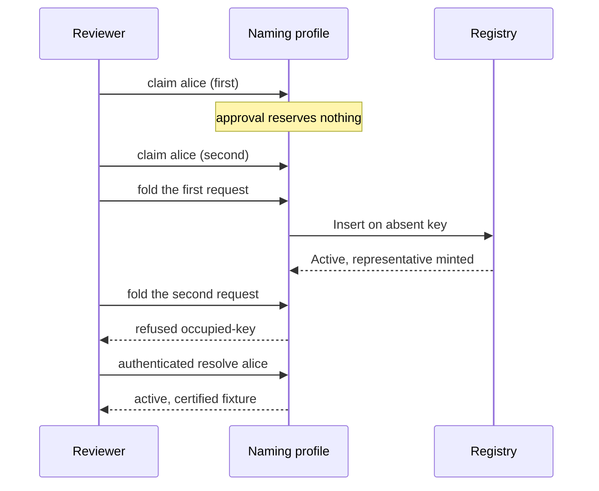

# First-release naming claims

## Who this is for

A reviewer who wants to play a naming claim in the docs, not read a
proposed walkthrough.

## What you can do

Open the docs, choose the labelled first-release naming profile, claim
the demo spelling `alice`, queue a second competing claim for the same
spelling, and fold each request in turn. The first valid fold of an
absent key succeeds. The competing fold is refused because that key is
already occupied. Authenticated observation then shows `alice` as
active, carrying the certified fixture fields.

## What you see when it is refused

Every refusal names its intended condition. A generic exception is a
defect.

| Attempt | Intended condition |
| --- | --- |
| Fold the duplicate after the first Insert committed | `occupied-key` |
| Craft a Delete (or name-release, or reuse) straight at the naming transition, bypassing the page | `naming-no-delete` |
| Queue an Insert with application approval rejected | `application-approval` |
| Certified initial representative does not match the registry | `representative-identity` |
| Proposal bound to the wrong registry or policy | `insert-binding` |
| Resolve without an authenticated view | `unauthenticated` |

Approval never occupies a spelling. Two queued claims for `alice` may
both sit pending. Uniqueness is decided only when a certified Insert
folds.

## First-release naming profile

The playable surface is an explicit profile, labelled as first-release
naming, and labelled as an unaccepted candidate. It is not the generic
registry demo.

Certification proves allowed request and initial construction only. It
does not prove person identity, entitlement to a spelling, or ownership
of a payment destination.

The demo spelling `alice` is a frozen finite-model fixture, not a name
normalization standard.

## Registry uniqueness at fold

```mermaid
stateDiagram-v2
  [*] --> Absent
  Absent --> Pending: queue certified Insert
  Pending --> Absent: still pending; no reservation
  Pending --> Active: first valid absent-key fold
  Active --> Active: competing fold refused occupied-key
```

A successful naming Insert of an absent certified key becomes Active
and mints the representative into the certified application output. The
output carries the fixture fields below, unchanged by the fold.

## Application fixture fields

The initial application record has four separate fields. Values are
finite-model fixtures, not product or economic policy.

| Field | Shape |
| --- | --- |
| Optional payment destination | zero or one natural number, and when present distinct from the controller |
| Current control address | natural number |
| Next-control commitment | natural number (the commitment, not a revealed next key) |
| Fixed retirement quorum | membership list and threshold, both present as structure |

This slice does not give those fields maintenance, recovery, or
retirement semantics.

## Generic profile stays generic

A separate generic profile remains available and labelled generic. It
can still perform generic Delete. It cannot silently become the naming
profile, and the naming profile cannot be bypassed by switching engines
without an explicit profile selection.

## Limits of this slice

Finite model: keys, addresses and commitments are natural numbers;
`alice` is a demo spelling. No ledger, validator, signature, wallet or
refund-payment execution. No on-chain acceptance.

Not implemented here, and not faked: payment-destination maintenance,
withdrawal of pending claims, recovery through the next-control
commitment, owner-or-quorum retirement, consumer-contract scenarios, or
a published release package.

The generic foundation of forty-one proved statements remains a
separate inventory. Naming theorems are a new inventory.

The live preview is bound to the pull-request head and states that the
candidate is unaccepted.
