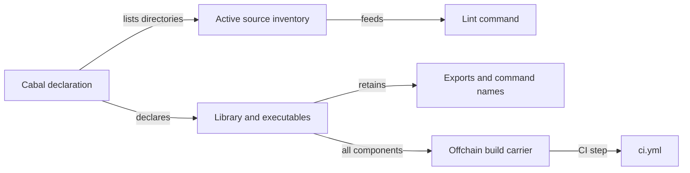

# Module ownership

As a contributor, I expect the lint entry point to cover the source directories
that own active Haskell components, while the Cabal package keeps the same
library and commands.

| ID | Owner | Changed responsibility |
| --- | --- | --- |
| M264-1 | `offchain/singular-registry.cabal` | Declare each library dependency once; retain component names, source directories and exposed modules. |
| M264-2 | `offchain/nix/checks.nix` | Discover active Haskell source extent for the existing lint app and state exclusions. |
| M264-3 | `offchain/flake.nix` | Expose a build closure over the Cabal library, executables and test components without executing them. |
| M264-4 | `.github/workflows/ci.yml` | Run that off-chain build closure as a named CI job without replacing existing jobs. |

No new Haskell module, dependency direction, facade, or runtime owner is
introduced by this slice.
