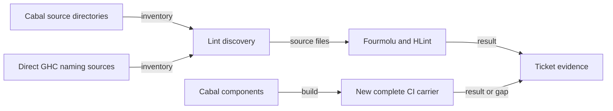

# Haskell lint coverage plan

As a contributor, I run the current lint command and see defects in active
registry sources, while existing libraries and commands retain their names.

## Decisions

| Decision | Reason |
| --- | --- |
| Keep one maintenance slice for Cabal deduplication, lint discovery and a complete build carrier. | They share the component inventory. |
| Review any layout-only source changes as a separate diff/commit. | It makes semantic changes visible and respects the source fence. |
| Use the existing lint executable for the negative control. | A source-name search does not establish that the executable rejects malformed input. |
| Keep the current exports and executable names as the compatibility baseline. | This ticket makes no public API or command migration. |

The implementation owner may change `offchain/singular-registry.cabal`,
`offchain/nix/checks.nix`, `offchain/flake.nix` and `.github/workflows/ci.yml`
under epic answer A-001. The new package `component-build` must close the
Haskell library, every declared executable, and every declared test component
through `components` from the current Cabal package; its CI step must run
`nix build --quiet .#component-build` from `offchain`. It builds but does not
execute tests or command journeys. Existing CI jobs and commands retain their
current meanings. The owner may propose separately reviewed layout-only
edits in active executable or naming source files when the expanded lint finds
them. Excluded source trees receive no edits. No source, test, Conformance, Lean,
or validator behavior changes are implied by this plan.

The owner must distinguish baseline failures from regressions, preserve actual
HLint semantics when handling hints, and produce a lint negative control in a
newly included active directory. The final owner receipt records the exact
source discovery and exclusions, Cabal declaration/export/name comparison,
component build commands/results, and actual lint results.

The active CI commands are copied verbatim into the frozen gate only after their
source closure is stated. The new `component-build` row is marked as a CI change
in this ticket and must be green on the pushed head. The root build gate never
stands for the off-chain component build.
