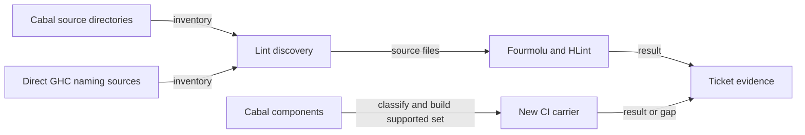

# Haskell lint coverage plan

As a contributor, I run the current lint command and see defects in active
registry sources, while existing libraries and commands retain their names.

## Decisions

| Decision | Reason |
| --- | --- |
| Keep one maintenance slice for Cabal deduplication, lint discovery and a classified supported-component carrier. | They share the component inventory; all 19 declarations retain a truthful row. |
| Review any layout-only source changes as a separate diff/commit. | It makes semantic changes visible and respects the source fence. |
| Use the existing lint executable for the negative control. | A source-name search does not establish that the executable rejects malformed input. |
| Keep the current exports and executable names as the compatibility baseline. | This ticket makes no public API or command migration. |

The implementation owner may change `offchain/singular-registry.cabal`,
`offchain/nix/checks.nix`, `offchain/flake.nix` and `.github/workflows/ci.yml`
under epic answer A-001. The initial all-component carrier was superseded by
A-005 after a direct `connected-verifier` RED. The classified
`component-build` carrier must close the supported set derived from live
required workflows and current supported command dependencies, with an
inventory row for every Cabal declaration; its CI step must run
`nix build --quiet .#component-build` from `offchain`. It builds but does not
execute tests or command journeys. Existing CI jobs and commands retain their
current meanings. The owner may propose separately reviewed layout-only
edits in active executable or naming source files when the expanded lint finds
them. Excluded source trees receive no edits. No source, test, Conformance, Lean,
or validator behavior changes are implied by this plan.

The owner must distinguish baseline failures from regressions, preserve actual
HLint semantics when handling hints, and produce a lint negative control in a
newly included active directory. The final owner receipt records the exact
source discovery and exclusions, Cabal declaration/export/name comparison,
component build commands/results, and actual lint results.

The active CI commands are copied verbatim into the frozen gate only after their
source closure is stated. The new `component-build` row is marked as a CI change
in this ticket and must be green on the pushed head. The root build gate never
stands for the off-chain component build.

## Coverage handoff

The exact candidate matrix distinguishes discovered files, Fourmolu files,
HLint directories and the component build closure. Epic ruling A-003 keeps two
independent verifier files at their intake bytes and outside Fourmolu in this
ticket. Existing HLint hints keep 13 directories outside HLint enforcement;
the current source snapshot measures 214 retained hints, while the intake
survey measured 218. These are visible gaps assigned to [final epic integration
#278](https://github.com/lambdasistemi/singular/issues/278), not green lint
evidence for those files. The final integration child must cover repository code
beyond off-chain Haskell too.

The initial all-component carrier included `connected-verifier` and failed on
an intake-era import of an unexported library symbol. Later attempts directly
failed at `recovery-rows` and `li01`. These remain RED evidence for those exact
members. The proposed classified carrier has ten built and nine unverified
members; it is not accepted until it builds and its exclusions and negative
controls receive independent review. The contributor guide explains the
commands and boundaries.

## A-011 release-instruction correction

The operator ruled the current release README outdated and chose a forward
correction on 2026-09-25. Correct the current archive README, release notes and
consumer guides to state which commands are verified under the integrated Lean
source and which legacy commands remain unbuildable or unverified. State that
already published archives cannot be rewritten. Preserve historical evidence,
component names and app names, while #172, #282 and #283 keep the repair work.
Inspect the deployment attach script's three legacy executable dependencies
against active required workflows and the carrier closure.

Make `check_release.py` enforce the corrected availability on the assembled
on-chain archive. Update `release_surface_control.sh` to mutate the new promise,
prove restored checksum integrity and fail specifically at that surface; wire
the control into the active `release-artifacts` boundary. Recut the gate with
the PR workflow's `release-check` and `release-artifacts` commands, obtain a
fresh independent gate and candidate audit, then run it on the exact clean
head. No current documentation correction is evidence that a legacy command
builds. Conformance remains excluded, and #278 owns full-repository lint and
format coverage.
