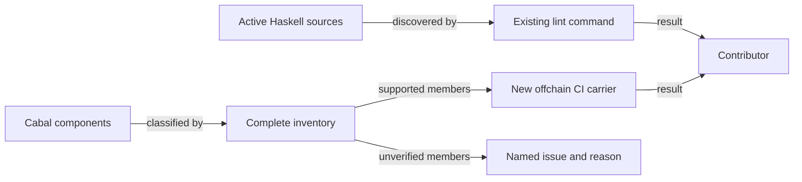

# Haskell lint coverage and component declarations

As a contributor, I want the existing lint command to inspect the active Haskell
sources used by registry components, so that a malformed source in a newly
included directory fails the command I already run. I want the supported
components consumed by current required workflows and shipped registry
commands to build with their existing public interfaces and command names.

The integrated Lean source revision for this maintenance slice is
`03fd9e0ec4777a39f40362a8025c48066b0cb597` on main
`80eba16049be11d90564db5d8a285ace695b33a8` (constitution 1.10.0).
Main's #258 integration changed exit-payment and driver judgements, and #239
now admits or refuses a retraction under its request, owner and phase witness
before judging what it spends or pays. This ticket's carrier and release checks
do not claim to verify those retraction behaviors. The archive's verified
bounded journey boots a registry, folds a request, applies it and reads state
back; it makes no retraction or retained naming-journey claim. The new model's
out-of-phase chain case remains #205 and its chain refusal reason remains
unobserved under #287.
This slice changes no Lean definition, behavior, wire representation,
transaction effect, or expected outcome. The repository constitution still
governs any discrepancy discovered while doing the work.

## Requirements

| ID | Requirement | Observable result |
| --- | --- | --- |
| R264-1 | Lint discovers every included active Haskell source directory, including the Cabal executables and naming sources beyond the four currently scanned directories. | The existing `.#lint` command rejects a deliberately malformed file placed in a newly covered active directory; the same command passes after removal. The inventory below explains any exclusion. |
| R264-2 | Remove only repeated dependency declarations from the Cabal component that contains them. | The Cabal declaration is unambiguous and the classified supported components build through the new CI carrier. |
| R264-3 | Preserve public library exports and executable names. | Compare the exact before and after Cabal declarations and build the supported components; identify every unbuilt legacy executable. |
| R264-4 | Keep formatting changes separate and mechanical. | A reviewer can identify layout-only source diffs apart from the two configuration files. Signatures, strictness, imports, and behavior remain stable. |
| R264-5 | Classify every Cabal component against live required workflows and currently supported command closure. | The inventory labels every declaration as built here, covered by another required job with command, or unbuildable/unverified with issue and reason. An unknown new component or omitted-classification drift makes the inventory gate fail; a selected included component's failure makes the carrier fail. Control mutations are restored byte-for-byte. |

## Source inventory at intake

The Cabal `hs-source-dirs` below are read from `offchain/singular-registry.cabal`
at the model/base revision above. `lib`, `app`, `test`, and `e2e-test` are in the
current lint command; every other listed directory is a coverage candidate.
The final PR must state the actual resulting discovery and each explicit
exclusion. `naming/test` and `naming/drift` are active direct-GHC checks outside
the Cabal component list and must be considered separately.

| Component | Source directory |
| --- | --- |
| library `singular-registry` | `lib`, `naming/src` |
| `cage-test-vectors` | `app/test-vectors` |
| `journey` | `journey` |
| `li01` | `journey/li01` |
| `naming-rows` | `journey/lmlc` |
| `recovery-rows` | `journey/recovery` |
| `retirement-rows` | `journey/retirement` |
| `register-rows` | `journey/register` |
| `li-refusals` | `journey/li-refusals` |
| `repair-rows` | `journey/repair` |
| `retirement-verify` | `journey/retire-verify` |
| `devnet` | `devnet` |
| `deployment` | `deployment` |
| `connected-verifier` | `journey/verifier` |
| `insert-active` | `insert-active` |
| `update-terminal` | `update-terminal` |
| `record-value-tests` | `record-value-test` |
| `cage-tests` | `test` |
| `e2e-tests` | `e2e-test` |

Conformance implementation, descriptions, receipts, books, publication and
workflow are excluded. So are Lean/model/mirror files, validator identities,
dependency upgrades, older naming journey behavior, and changes to independent
verifier logic. If format-only changes to an active source are needed for lint,
they require their own reviewable diff.

## Evidence limit

CI currently runs `(cd offchain && nix run --quiet .#lint)` and root
`nix build --quiet .#build-gate`. The root build gate closes root docs/model
packages, not all off-chain Cabal components. Selected registry workflow jobs
build off-chain targets. The epic owner answered Q-001 by authorizing a new
off-chain component build carrier in `ci.yml` and `offchain/flake.nix`. A-005,
A-008 and A-009 narrow its required scope to the components used by current
required workflows and currently supported registry commands, plus the library
and its test components. The carrier must reject an unclassified new component,
omitted-classification drift and any build failure in its included set. A green
carrier establishes only that set, never a package-wide build.

## Candidate boundary and epic completion

At source revision `b69ecca7b7c5efb9f2106d9717d3e2bcb275b063`, Gate S v11
and the exact pushed-head Off-chain lint CI job discovered 70 off-chain Haskell
files in 22 source directories: 20 Cabal source-directory values and two
direct-GHC naming directories. This documentation correction changes no source
file or discovery rule, so the measured extent remains the source baseline for
the next head; its own CI result must still be checked. Discovery is broader
than enforcement. Under the epic owner's source ruling, Fourmolu checks 68
files and leaves two independent verifier files byte-identical to intake.
HLint checks 57 files in 9 directories; 13 files fall outside that HLint run
under 13 configured debt-directory names. The 214-hint count belongs to an
earlier candidate snapshot, and the intake survey found 218; neither is a
current-head HLint result or a waiver for excluded sources. The exact
per-directory debt and check boundaries are recorded beside the executable
lint command and in the candidate evidence.

Epic #272 can claim all-code lint and format coverage only after [final
integration #278](https://github.com/lambdasistemi/singular/issues/278) maps
every tracked code source to actual checks, including code beyond off-chain
Haskell. This ticket supplies the bounded off-chain foundation and reports its
gaps. The independent verifier source fence remains in force here. The first
full component carrier run found a pre-existing compile error in
`connected-verifier`; its failed receipt is retained. A-005 assigns that
executable's repair to [#282](https://github.com/lambdasistemi/singular/issues/282)
and requires it to remain declared and marked unbuildable/unverified in this
ticket's component inventory. The next carrier run directly failed at
`recovery-rows`, which imports the removed `registerConsumerImpl`. A-008 maps
the named retired D6 NYA journeys `recovery-rows`, `retirement-rows` and
`repair-rows` to [#172](https://github.com/lambdasistemi/singular/issues/172)
after exact source/workflow and current dependency checks. A-009 maps
`register-rows`, which D6 does not name, to
[#283](https://github.com/lambdasistemi/singular/issues/283) as a separate
unbuildable/unverified command. The current carrier receipt does not prove
those other executables' own build results. All five remain declared and
exposed. That 14/5 proposal was superseded by a 10-built/9-unverified
classification after all seven named legacy journeys were assessed. The
classified carrier inventories all 19 declarations and its ten-member
included set passed the exact `b69ecca` Gate S v11 and pushed-head CI job,
with independent Opus review of the carrier and its direct negative controls.
This is compile/inventory evidence only; none of the nine retained commands
gains a build or journey pass. #278 still owns lint and formatting of every
retained source.

## A-011 forward correction to current release instructions

As a person reading the current on-chain archive instructions, I need to know
which commands have been built and verified against the integrated Lean source
before I attempt a registry lifecycle journey. The old README presents seven
retained legacy commands as runnable today. Direct component-build attempts
failed at `recovery-rows` and `li01`; the other legacy commands have no direct
passing build evidence in this ticket. The operator ruled on 2026-09-25 that
the current release README is outdated and directed a forward correction of
release/user instructions and checker. The ruling changes the current source
and future archives; it cannot rewrite already published archives. The old
instructions, failed receipts and component names remain historical facts.

The release archive and current consumer guides must distinguish commands
verified under the integrated Lean source from retained commands that are
unbuildable or unverified. `tools/check_release.py` must assert that corrected
availability on the actual assembled on-chain archive. An executable negative
control must falsify the new availability promise, re-establish checksum
integrity, and fail specifically at the release surface; the active PR archive
build must execute that control. `offchain/deployment-attach-check.sh` must be
classified as a possible consumer: if any active required workflow or supported
carrier command depends on its three legacy row runners, that dependency stays
RED until built. No documentation edit can establish command buildability.
Keep #172, #282 and #283 as the distinct repairs; preserve Cabal declarations,
apps, public names, historical tags and archives. Conformance remains outside
this ticket. The 10/9 carrier received direct negative controls, an actual
GREEN build, and independent review at the `b69ecca` candidate. Its Gate S v11
ran `release-artifacts` GREEN and recorded local `release-check` as HOST-BLOCKED
under A-012; the exact pushed-head `release-check` CI job passed. The subsequent
documentation correction at `e276bab` passed its own Opus review, Gate S v12
and exact-head CI on the earlier main base `2ae29b0`. After main advanced to
`80eba16` through #289, those results became historical SHA-bound evidence;
the rebased candidate needs fresh review, gate and exact pushed-head CI before
epic acceptance. #278 retains the separate all-code lint and formatting
obligation.
