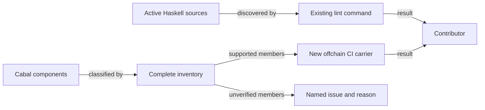
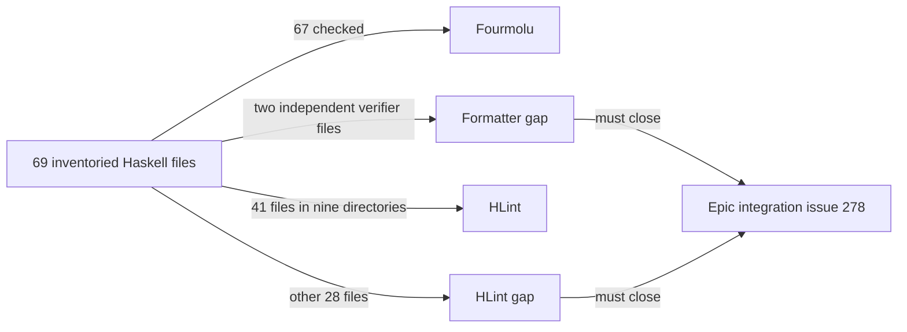

# Haskell lint coverage and component declarations

As a contributor, I want the existing lint command to inspect the active Haskell
sources used by registry components, so that a malformed source in a newly
included directory fails the command I already run. I want the supported
components consumed by current required workflows and shipped registry
commands to build with their existing public interfaces and command names.

The accepted Lean revision for this maintenance slice is
`0b9b461205d4ef5a67bb41fba56d88b2a3a0ded1`. This slice changes no Lean
definition, behavior, wire representation, transaction effect, or expected
outcome. The repository constitution still governs any discrepancy discovered
while doing the work.

## Requirements

| ID | Requirement | Observable result |
| --- | --- | --- |
| R264-1 | Lint discovers every included active Haskell source directory, including the Cabal executables and naming sources beyond the four currently scanned directories. | The existing `.#lint` command rejects a deliberately malformed file placed in a newly covered active directory; the same command passes after removal. The inventory below explains any exclusion. |
| R264-2 | Remove only repeated dependency declarations from the Cabal component that contains them. | The Cabal declaration is unambiguous and the classified supported components build through the new CI carrier. |
| R264-3 | Preserve public library exports and executable names. | Compare the exact before and after Cabal declarations and build the supported components; identify every unbuilt legacy executable. |
| R264-4 | Keep formatting changes separate and mechanical. | A reviewer can identify layout-only source diffs apart from the two configuration files. Signatures, strictness, imports, and behavior remain stable. |
| R264-5 | Classify every Cabal component against live required workflows and currently supported command closure. | The inventory labels every declaration as built here, covered by another required job with command, or unbuildable/unverified with issue and reason. An unknown new component or omitted-classification drift makes the inventory gate fail; a selected included component's failure makes the carrier fail. Control mutations are restored byte-for-byte. |

## Source inventory at intake

The Cabal `hs-source-dirs` below are read from `offchain/singular-registry.cabal`
at the model/base revision above. `lib`, `app`, `test`, and `e2e-test` are in the
current lint command; every other listed directory is a coverage candidate.
The final PR must state the actual resulting discovery and each explicit
exclusion. `naming/test` and `naming/drift` are active direct-GHC checks outside
the Cabal component list and must be considered separately.

| Component | Source directory |
| --- | --- |
| library `singular-registry` | `lib`, `naming/src` |
| `cage-test-vectors` | `app/test-vectors` |
| `journey` | `journey` |
| `li01` | `journey/li01` |
| `naming-rows` | `journey/lmlc` |
| `recovery-rows` | `journey/recovery` |
| `retirement-rows` | `journey/retirement` |
| `register-rows` | `journey/register` |
| `li-refusals` | `journey/li-refusals` |
| `repair-rows` | `journey/repair` |
| `retirement-verify` | `journey/retire-verify` |
| `devnet` | `devnet` |
| `deployment` | `deployment` |
| `connected-verifier` | `journey/verifier` |
| `insert-active` | `insert-active` |
| `update-terminal` | `update-terminal` |
| `record-value-tests` | `record-value-test` |
| `cage-tests` | `test` |
| `e2e-tests` | `e2e-test` |

Conformance implementation, descriptions, receipts, books, publication and
workflow are excluded. So are Lean/model/mirror files, validator identities,
dependency upgrades, older naming journey behavior, and changes to independent
verifier logic. If format-only changes to an active source are needed for lint,
they require their own reviewable diff.

## Evidence limit

CI currently runs `(cd offchain && nix run --quiet .#lint)` and root
`nix build --quiet .#build-gate`. The root build gate closes root docs/model
packages, not all off-chain Cabal components. Selected registry workflow jobs
build off-chain targets. The epic owner answered Q-001 by authorizing a new
off-chain component build carrier in `ci.yml` and `offchain/flake.nix`. A-005,
A-008 and A-009 narrow its required scope to the components used by current
required workflows and currently supported registry commands, plus the library
and its test components. The carrier must reject an unclassified new component,
omitted-classification drift and any build failure in its included set. A green
carrier establishes only that set, never a package-wide build.

## Candidate boundary and epic completion

The current local candidate discovers 69 tracked off-chain Haskell files in 22
source directories: 20 Cabal source-directory values and two direct-GHC naming
directories. Discovery is broader than enforcement. Under the epic owner's
source ruling, Fourmolu checks 67 files and leaves the two independent verifier
files byte-identical to intake. HLint checks 9 directories and excludes 13
directories with 214 measured hints in the current source state; the earlier
intake survey found 218 hints before layout and verifier restoration changed
the measured snapshot. Neither count is a waiver or a claim that excluded
sources pass. The exact per-directory debt and check boundaries are recorded
beside the executable lint command and in its candidate matrix.

Epic #272 can claim all-code lint and format coverage only after [final
integration #278](https://github.com/lambdasistemi/singular/issues/278) maps
every tracked code source to actual checks, including code beyond off-chain
Haskell. This ticket supplies the bounded off-chain foundation and reports its
gaps. The independent verifier source fence remains in force here. The first
full component carrier run found a pre-existing compile error in
`connected-verifier`; its failed receipt is retained. A-005 assigns that
executable's repair to [#282](https://github.com/lambdasistemi/singular/issues/282)
and requires it to remain declared and marked unbuildable/unverified in this
ticket's component inventory. The next carrier run directly failed at
`recovery-rows`, which imports the removed `registerConsumerImpl`. A-008 maps
the named retired D6 NYA journeys `recovery-rows`, `retirement-rows` and
`repair-rows` to [#172](https://github.com/lambdasistemi/singular/issues/172)
after exact source/workflow and current dependency checks. A-009 maps
`register-rows`, which D6 does not name, to
[#283](https://github.com/lambdasistemi/singular/issues/283) as a separate
unbuildable/unverified command. The current carrier receipt does not prove
those other executables' own build results. All five remain declared and
exposed. The proposed inventory has 14 included and five unverified members,
subject to actual command closure. #278 still owns lint and formatting of
every retained source. The final candidate must publish all 19 declarations'
classification and demonstrate the narrower carrier and its controls.
