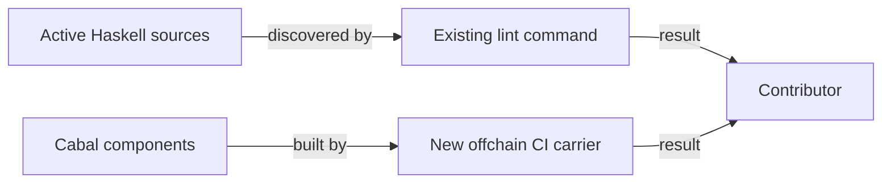

# Haskell lint coverage and component declarations

As a contributor, I want the existing lint command to inspect the active Haskell
sources used by registry components, so that a malformed source in a newly
included directory fails the command I already run. I want every affected
component to build with its existing public interface and command name.

The accepted Lean revision for this maintenance slice is
`0b9b461205d4ef5a67bb41fba56d88b2a3a0ded1`. This slice changes no Lean
definition, behavior, wire representation, transaction effect, or expected
outcome. The repository constitution still governs any discrepancy discovered
while doing the work.

## Requirements

| ID | Requirement | Observable result |
| --- | --- | --- |
| R264-1 | Lint discovers every included active Haskell source directory, including the Cabal executables and naming sources beyond the four currently scanned directories. | The existing `.#lint` command rejects a deliberately malformed file placed in a newly covered active directory; the same command passes after removal. The inventory below explains any exclusion. |
| R264-2 | Remove only repeated dependency declarations from the Cabal component that contains them. | The Cabal declaration is unambiguous and affected components build through the new CI carrier. |
| R264-3 | Preserve public library exports and executable names. | Compare the exact before and after Cabal declarations and build the relevant components. |
| R264-4 | Keep formatting changes separate and mechanical. | A reviewer can identify layout-only source diffs apart from the two configuration files. Signatures, strictness, imports, and behavior remain stable. |

## Source inventory at intake

The Cabal `hs-source-dirs` below are read from `offchain/singular-registry.cabal`
at the model/base revision above. `lib`, `app`, `test`, and `e2e-test` are in the
current lint command; every other listed directory is a coverage candidate.
The final PR must state the actual resulting discovery and each explicit
exclusion. `naming/test` and `naming/drift` are active direct-GHC checks outside
the Cabal component list and must be considered separately.

| Component | Source directory |
| --- | --- |
| library `singular-registry` | `lib`, `naming/src` |
| `cage-test-vectors` | `app/test-vectors` |
| `journey` | `journey` |
| `li01` | `journey/li01` |
| `naming-rows` | `journey/lmlc` |
| `recovery-rows` | `journey/recovery` |
| `retirement-rows` | `journey/retirement` |
| `register-rows` | `journey/register` |
| `li-refusals` | `journey/li-refusals` |
| `repair-rows` | `journey/repair` |
| `retirement-verify` | `journey/retire-verify` |
| `devnet` | `devnet` |
| `deployment` | `deployment` |
| `connected-verifier` | `journey/verifier` |
| `insert-active` | `insert-active` |
| `update-terminal` | `update-terminal` |
| `record-value-tests` | `record-value-test` |
| `cage-tests` | `test` |
| `e2e-tests` | `e2e-test` |

Conformance implementation, descriptions, receipts, books, publication and
workflow are excluded. So are Lean/model/mirror files, validator identities,
dependency upgrades, older naming journey behavior, and changes to independent
verifier logic. If format-only changes to an active source are needed for lint,
they require their own reviewable diff.

## Evidence limit

CI currently runs `(cd offchain && nix run --quiet .#lint)` and root
`nix build --quiet .#build-gate`. The root build gate closes root docs/model
packages, not all off-chain Cabal components. Selected registry workflow jobs
build off-chain targets. The epic owner answered Q-001 by authorizing a new
off-chain component build carrier in `ci.yml` and `offchain/flake.nix`. Until
that job is present and green on the candidate, full build coverage remains
`MISSING-CI-JOB`.
