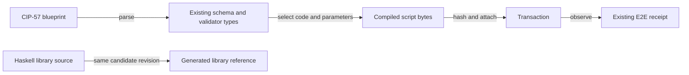

# Data and identity boundary

As an integrator, I want the same compiled script and ledger data to reach the
same transaction and refusal paths after the modules move.

## Identity contracts

| ID | Existing value | Constraint |
| --- | --- | --- |
| D265-1 | `Blueprint`, `Validator`, `Schema`, `Constructor`, `NamingCodes` | Retain constructors, fields, instances and public export path. |
| D265-2 | `ConsumerBinding` | Retain fields, script bytes and hash derivation. |
| D265-3 | Ledger datum, script hash, address, token and UTxO references | Preserve encodings, order and failure behavior. |
| D265-4 | Generated library API artifact | Bind rendered Haddock to the candidate library source content and complete Cabal `exposed-modules` plus `other-modules` inventory; local module/source links must resolve in the site build, and the same pages must appear in the future docs archive. |

No schema or wire migration is authorized. The declaration map records any
type and instance move together.
