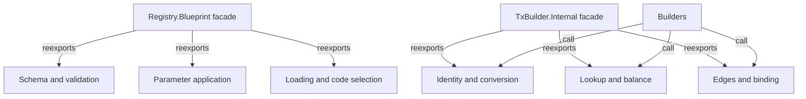

# Module ownership

As a contributor, I want one owner for each shared concern, while a caller of
the established modules keeps its import path and result.

| ID | Responsibility | Dependency constraint |
| --- | --- | --- |
| M265-1 | Blueprint schema parsing and validation | No implementation import of the Blueprint facade. |
| M265-2 | Blueprint parameter application and compiled code selection/loading | Preserve parameter order and failure text; no facade cycle. |
| M265-3 | Builder script identity and ledger/data conversion | Preserve bytes, hash derivations and public type signatures. |
| M265-4 | Builder UTxO lookup, balancing/integrity and time | Preserve lookup order, effects and error behavior. |
| M265-5 | Builder failure attribution, consumer binding and edge decisions | Preserve independent expected evidence and one decision owner. |
| M265-6 | Existing public facades | Explicit original exports only; no duplicate bodies. |

Owners may split further only when the resulting dependency graph remains
acyclic and the responsibility remains evident. The 150–350 line guide is a
review aid; a module over 500 lines needs an explanation, not automatic failure.
