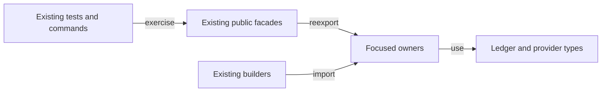

# Extraction plan

As a contributor, I want the common builder responsibilities to have visible
owners, so a change to a script, datum or lookup can be reviewed without
searching a single large helper module.

## Ordered work

1. Freeze intake exports, declaration locations, accepted Lean tree and
   overlapping PR #219 Cabal rows. Add only the necessary Cabal module rows.
2. Extract blueprint schema/validation, parameter application and loading or
   code selection behind `Singular.Registry.Blueprint`.
3. Extract builder identity/conversion, UTxO lookup, balancing/integrity,
   time, failure attribution, consumer binding and edge decisions behind
   `Singular.Registry.TxBuilder.Internal`.
4. Move internal caller imports to focused owners when safe. Keep public
   compatibility imports and unchanged Conformance consumers working.
5. Publish contributor architecture/module documentation and speech; compare
   declaration map, run source/format checks, component build, focused suite,
   fresh blueprint E2E, journey and archive workflow rows.

Each extraction may be committed in a bisect-safe slice. If it needs an
excluded edit, a changed body, new abstraction, or a model ruling, stop and
send a question to the ticket owner. Do not silently treat pre-existing
component limits as passes.

## Gate and resource policy

Gate S follows the verbatim active CI commands from `ci.yml` and
`registry.yml`; its runtime manifest binds the exact command list and source
closure. Cheap invocations are local parser/format/compile probes without Nix
or network; expensive invocations are Nix builds, Nix apps and devnet steps.
The coder may use up to 40 cheap and 12 expensive invocations; the auditor may
launch at most two CLI processes and does not run the product gate. Every
invocation gets a separate receipt and is checked before launch. The ticket
owner owns final exact-head Gate S and CI handback.
