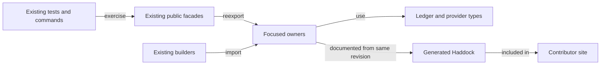

# Extraction plan

As a contributor, I want the common builder responsibilities to have visible
owners, so a change to a script, datum or lookup can be reviewed without
searching a single large helper module.

## Ordered work

1. Freeze intake exports, declaration locations, accepted Lean tree and
   overlapping PR #219 Cabal rows. Add only the necessary Cabal module rows.
2. Extract blueprint schema/validation, parameter application and loading or
   code selection behind `Singular.Registry.Blueprint`.
3. Extract builder identity/conversion, UTxO lookup, balancing/integrity,
   time, failure attribution, consumer binding and edge decisions behind
   `Singular.Registry.TxBuilder.Internal`.
4. Move internal caller imports to focused owners when safe. Keep public
   compatibility imports and unchanged Conformance consumers working.
5. Publish contributor architecture/module documentation and speech; compare
   declaration map, run source/format checks, component build, focused suite,
   fresh blueprint E2E, journey and archive workflow rows.
6. Under epic answer A-001, generate Haddock for the affected off-chain
   library from the same candidate revision, include it in the built site,
   derive all library modules from Cabal (`exposed-modules` and
   `other-modules`) and make the existing `docs-check` job reject a missing
   module/source reference or content that differs from the candidate source.
   Run one disposable content-mismatch negative control at that exact command
   boundary.
7. Under epic answer A-002, wire one local off-chain input into the root
   docs build with existing upstream pins unchanged, check the generated
   reference against this candidate's off-chain source content, and make the
   existing `release-check` verify that the future documentation archive
   carries the same API pages. Record the root lock node/input delta.

Each extraction may be committed in a bisect-safe slice. If it needs an
excluded edit, a changed body, new abstraction, or a model ruling, stop and
send a question to the ticket owner. Do not silently treat pre-existing
component limits as passes.

## Gate and resource policy

Gate S follows the verbatim active CI commands from `ci.yml` and
`registry.yml`; its runtime manifest binds the exact command list and source
closure. Cheap invocations are local parser/format/compile probes without Nix
or network; expensive invocations are Nix builds, Nix apps and devnet steps.
The coder may use up to 40 cheap and 12 expensive invocations; the auditor may
launch at most two CLI processes and does not run the product gate. Every
invocation gets a separate receipt and is checked before launch. The ticket
owner owns final exact-head Gate S and CI handback.

Gate S v2 adds the generated API requirement to the existing
`nix run --quiet .#docs-check` and `nix run --quiet .#release-check` CI
commands without changing its older rows.
The documentation slice starts only after the source slice has a committed
checkpoint, a revised Gate S binding and an independent auditor contract
review. Authorized extra paths are limited to `nix/docs.nix`, root
`flake.nix` and `flake.lock`, off-chain flake/project wiring if needed,
`tools/prepare_docs.py`,
`tools/check_site.py`, `mkdocs.yml`, directly relevant docs and speech,
and one focused checker if the existing checker cannot express the claim.
Workflow, release and publication script edits require separate authority.
The authorized root lock delta may add the local input and its transitive
nodes, but cannot change existing upstream pin revisions or hashes. The
off-chain lockfile is read-only. The documentation implementation starts only
after a source checkpoint, frozen gate and independent contract approval.
