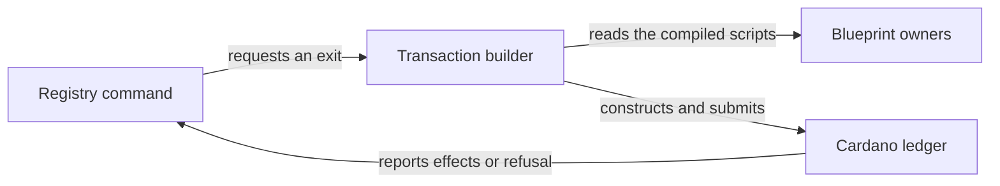
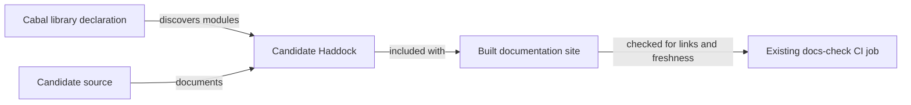

# Focus the registry builder and blueprint modules

As an integrator, I want the existing registry transaction commands to keep
their outcomes after shared builder and blueprint work is separated into
coherent modules. A refusal must still identify the same failed witness or
budget condition, and a built transaction must still carry the same scripts,
data, payments and identities.

The accepted Lean source revision is
`03fd9e0ec4777a39f40362a8025c48066b0cb597`; intake base is
`887cde00331dd21b0de18e68c62bdd5bfbef7ab0` (constitution 1.10.0).
This is a representation change. Lean's exit, transaction, settlement and
admission definitions remain the behavioral authority. No Lean, wire,
validator, public export or Conformance expectation changes are authorized.

## Requirements

| ID | Requirement | Observable result |
| --- | --- | --- |
| R265-1 | Every declaration moved from either source module has one implementation; preserve type and body except import or qualification mechanics. | A before and after declaration map accounts for the complete moved set, with no duplicate implementation. |
| R265-2 | The existing public modules retain exports and signatures while implementation modules depend on focused owners. | Old callers, including unchanged Conformance consumers, compile through the same imports; dependencies remain acyclic. |
| R265-3 | Script identity, conversion, lookup, balancing and integrity, time, failure attribution, consumer binding and edge decisions have distinct owners where useful. Blueprint schema, parameter and loading work is similarly separated. | Review can identify one coherent owner per concern and a contributor can find where to change it. |
| R265-4 | Builder and blueprint results, including failures, stay equivalent. | Existing parameter, failure attribution, builder, fresh blueprint E2E, journey and archive commands pass at the exact candidate with meaningful negative controls. |
| R265-5 | Contributor architecture and module documentation follows the actual dependency and execution paths. | The site navigation, source/API links, diagram and speech companion pass the existing presentation and docs checks. |
| R265-6 | The affected off-chain library has a generated API reference from the candidate revision, with every Cabal-declared library module and its source discoverable in the built site and future docs archive. | The existing `docs-check` job compares the reference's module and source content with this candidate's Cabal library stanza, including `exposed-modules` and `other-modules`, and fails on a missing or stale page, candidate binding or local link; a disposable content-mismatch control demonstrates that failure. The existing `release-check` job verifies that the staged archive carries the same reference. |

## Acceptance boundary

`#198` / draft PR #219 also edits Cabal declarations and tests. This ticket
adds only declarations needed for extracted modules, leaves its assertions and
`TxBuilder/Retract.hs` unchanged, and records any actual overlap for the epic
owner. A green build is a compile claim, not transaction correspondence. The
live workflow observations and independent expected behavior keep their own
evidence limits.

Epic answers A-001 and A-002 authorize a bounded documentation build extension in this
child so the generated Haddock reference appears beside the contributor guide.
They allow one local off-chain root flake input and root lock entries, with
every existing upstream pin and the off-chain lockfile unchanged. They do not
authorize release or publication. The Conformance library's
generated reference remains #276's responsibility; #278 audits integrated
documentation and all-library coverage. A local site build is not a served
Pages claim.
The generated site also feeds the existing root build gate and future
documentation archive; this ticket changes no release or publication script
and claims no released archive. The archive must contain the same generated
API pages, while the existing `release-check` remains a real check.

