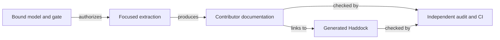

# Delivery tasks

As an integrator, I expect a reviewable extraction whose old commands still
work and whose evidence names what was actually checked.

## Completion sequence

| Task | Completion evidence |
| --- | --- |
| T265-01 | Intake binding, PR #219 overlap disposition, frozen gate and RED controls. |
| T265-02 | Blueprint extraction with complete declaration mapping and original facade exports. |
| T265-03 | Builder extraction with focused imports, complete mapping and acyclic owners. |
| T265-04 | Contributor architecture, navigation, module references and speech companion. |
| T265-05 | Exact-head Gate S results, unchanged consumer compile checks, independent Opus checkpoint report and draft PR handback. |
| T265-06 | Same-revision generated Haddock reference for the affected off-chain library, Cabal-derived `exposed-modules` and `other-modules` source navigation, exact `docs-check` content-mismatch negative control, and existing `release-check` future archive check under A-001/A-002. |
