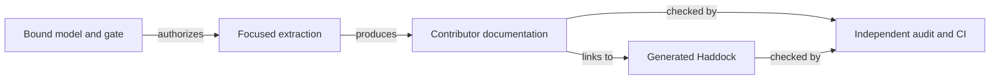

# Delivery tasks

As an integrator, I expect a reviewable extraction whose old commands still
work and whose evidence names what was actually checked.

```mermaid
flowchart LR
    Plan[Bound model and gate] -->|authorizes| Extract[Focused extraction]
    Extract -->|produces| Docs[Contributor documentation]
    Docs -->|checked by| Audit[Independent audit and CI]
    Docs -->|links to| API[Generated Haddock]
    API -->|checked by| Audit
```

## Completion sequence

| Task | Completion evidence | Status |
| --- | --- | --- |
| intake-binding-pr-overlap-disposition-frozen-gate | Intake binding, PR #219 overlap disposition, frozen gate and RED controls. | Done |
| blueprint-extraction-complete-declaration-mapping-original-facade | Blueprint extraction with complete declaration mapping and original facade exports. | Done |
| builder-extraction-focused-imports-complete-mapping-acyclic | Builder extraction with focused imports, complete mapping and acyclic owners. | Done |
| contributor-architecture-navigation-module-references-speech-companion | Contributor architecture, navigation, module references and speech companion. | Done |
| exact-head-acceptance-checks-results-unchanged-consumer | Exact-head acceptance checks results, unchanged consumer compile checks, independent Opus checkpoint report and draft PR handback. | Done |
| same-revision-generated-haddock-reference-for-affected | Same-revision generated Haddock reference for the affected off-chain library, Cabal-derived `exposed-modules` and `other-modules` source navigation, exact `docs-check` content-mismatch negative control, and existing `release-check` future archive check under operator answer (A-001)/A-002. | Done |
