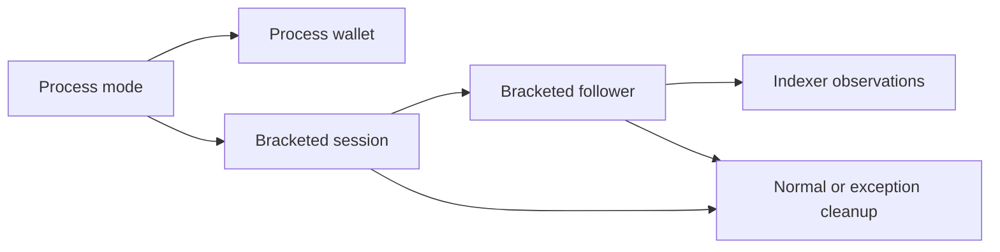

# Node state and lifetime

As an operator, I need one live session and follower to remain the source of
connection and confirmation state while a runner acts.

## State contracts

| ID | State | Owner and invariant |
| --- | --- | --- |
| D266-1 | `runMode` | Options alone evaluates command line and environment once, under its existing `NOINLINE` boundary. |
| D266-2 | `processWallet` | Wallet alone loads the wallet once from `runMode`, preserving lazy first-use timing and `NOINLINE`. |
| D266-3 | `openSession` | Session alone installs `Just` for the runner body and restores `Nothing` at bracket exit, including exceptions. |
| D266-4 | `chainFollower` | Indexer alone installs the follower for its action and clears it at bracket exit. |
| D266-5 | `fundingIndexed` | Indexer alone sets the devnet funding-read guard after sweep and clears it with the follower. |
| D266-6 | `addressReads` | Indexer alone increments the existing counter for actual node address queries; the public read keeps its current process total. |

`NodeSession`, `NodeMode`, `ExternalNode`, `Wallet` and `FundingFloor` retain
their constructors, fields and old facade path. No explicit session API or
replacement for `unsafePerformIO` is introduced. The devnet node is bracketed
and torn down with the session; an external node remains owned by its operator.
