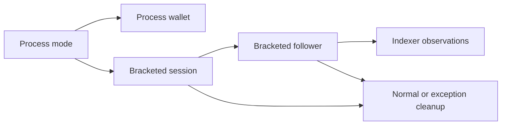

# Node state and lifetime

As an operator, I need one live session and follower to remain the source of
connection and confirmation state while a runner acts.

```mermaid
flowchart LR
    Mode[Process mode] --> Wallet[Process wallet]
    Mode --> Session[Bracketed session]
    Session --> Follower[Bracketed follower]
    Follower --> Observations[Indexer observations]
    Session --> Cleanup[Normal or exception cleanup]
    Follower --> Cleanup
```

## State contracts

| ID | State | Owner and invariant |
| --- | --- | --- |
| options-alone-evaluates-command-line-environment-once | `runMode` | Options alone evaluates command line and environment once, under its existing `NOINLINE` boundary. |
| wallet-alone-loads-wallet-once-from-runmode | `processWallet` | Wallet alone loads the wallet once from `runMode`, preserving lazy first-use timing and `NOINLINE`. |
| session-alone-installs-just-for-runner-body | `openSession` | Session alone installs `Just` for the runner body and restores `Nothing` at bracket exit, including exceptions. |
| indexer-alone-installs-follower-for-its-action | `chainFollower` | Indexer alone installs the follower for its action and clears it at bracket exit. |
| indexer-alone-sets-devnet-funding-read-guard | `fundingIndexed` | Indexer alone sets the devnet funding-read guard after sweep and clears it with the follower. |
| indexer-alone-increments-existing-counter-for-actual | `addressReads` | Indexer alone increments the existing counter for actual node address queries; the public read keeps its current process total. |

`NodeSession`, `NodeMode`, `ExternalNode`, `Wallet` and `FundingFloor` retain
their constructors, fields and old facade path. No explicit session API or
replacement for `unsafePerformIO` is introduced. The devnet node is bracketed
and torn down with the session; an external node remains owned by its operator.
