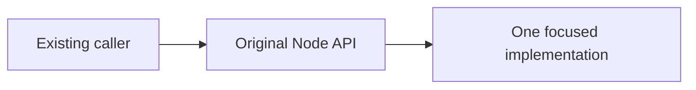

# Node callable contracts

As a caller, I want the same Node operations and diagnostics after their
definitions move.

## Signature families

| ID | Existing callable family | Constraint |
| --- | --- | --- |
| F266-1 | `nodeModeFromArgs`, `nodeModeFromEnvironment`, `runMode`, `nodeIsExternal`, `echoKoios` | Preserve argument, result, precedence and diagnostic contracts. |
| F266-2 | `loadWallet`, `walletForMode`, `funderAddr`, `funderSignKey`, `sessionMagic`, `bech32Address` | Preserve key bytes, address, network and logging behavior. |
| F266-3 | `withNode`, `withNodeForPlannedFunding`, `withNodeMode`, `withNodeSocket`, `devnetGenesis`, `awaitConnection`, `scriptStakeRegistered`, `currentTipSlot` | Preserve callback, resource, connection and cleanup behavior. |
| F266-4 | `withDevnetIndexer`, `followedProvider`, `adaptProvider`, `awaitIndexed`, `nodeAddressReads` | Preserve follower start, indexed versus node reads, genesis sweep and address-read guard. |
| F266-5 | `awaitTx`, `awaitTxId`, `awaitTxWindow`, `awaitChain`, `confirmDeadline`, `txUpperBoundSlot`, `confirmationDelay` | Preserve confirmation observations, deadlines and named failures. |
| F266-6 | `defaultFundingFloor`, `checkFunding` | Preserve funding thresholds and error details. |

These are existing signatures and effects, not permission to add a new public
API. The complete before and after declaration map is a delivery receipt.
