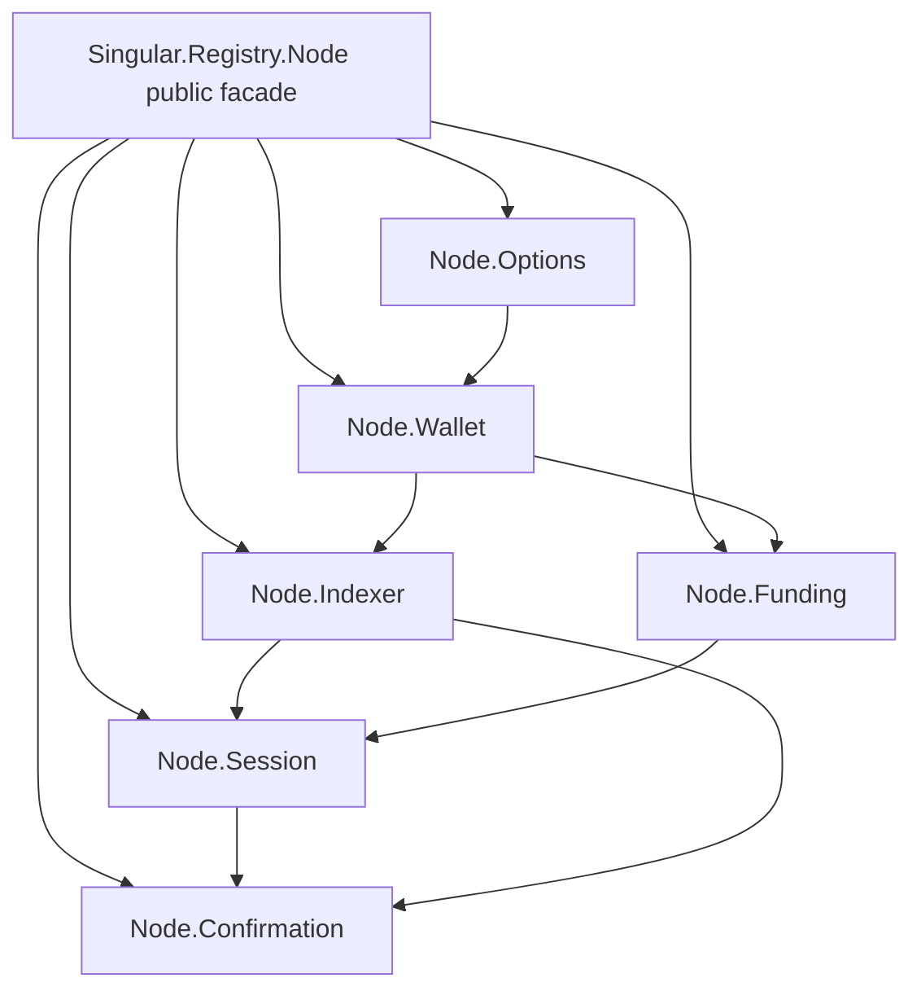

# Node module ownership

As a contributor, I need a directed owner graph, so I can change shared node
behavior without creating a second copy of state or a cycle.

## Responsibilities

| ID | Owner | Responsibility and direction |
| --- | --- | --- |
| M266-O | `Node.Options` | Parse mode flags and environment, own the one-time process mode and mode-specific diagnostics. No dependency on runtime modules. |
| M266-W | `Node.Wallet` | Parse signing keys, derive addresses, own the one-time process wallet and expose the original funding identity through the facade. Depends on options. |
| M266-I | `Node.Indexer` | Own follower state, genesis sweep state, provider address-read guard and counter; follow a chain and answer indexed reads. Depends on wallet and options. |
| M266-F | `Node.Funding` | Own funding floor checks and their existing diagnostics. Depends on wallet presentation. |
| M266-S | `Node.Session` | Own open session state, node client connection, protocol parameters, mode-specific setup and bracketed lifecycle. Depends on options, wallet, indexer and funding. |
| M266-C | `Node.Confirmation` | Own waits, deadlines and chain observation. Reads the session and follower through their owners; neither owner imports confirmation. |
| M266-N | `Singular.Registry.Node` | Compatibility facade retaining its exact public export list and old caller imports. It owns no copied global. |

The owner may choose a smaller acyclic graph when the actual type dependencies
require it, but must version this plan before changing a listed owner or adding
a module. Each moved declaration gets exactly one before and after entry.
