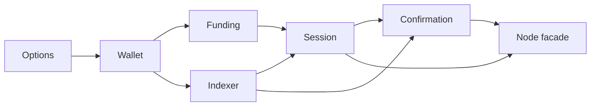

# Node extraction plan

As a contributor, I want one place for each node concern and a clear lifetime
boundary, so a future edit cannot accidentally duplicate process state.

## Ordered work

1. Freeze the facade export list, all declaration locations and globals at the
   intake base; bind the current Lean source and model tree. Keep the existing
   Cabal library component and add only justified module declarations.
2. Extract options, then wallet parsing and process wallet ownership. Preserve
   one-time process initialization and public facade exports.
3. Extract follower and address-read ownership, funding checks, session
   construction and confirmation. Preserve bracket nesting and cleanup on
   normal return and exceptions; keep each IORef in one owner.
4. Retain old callers through the facade; change imports only where an actual
   dependency requires it. Add a focused behavior and cleanup check, including
   an executable negative control that reaches the intended assertion.
5. Publish contributor architecture and module documentation with a diagram,
   actual source and generated API links, navigation and curated speech.
   Verify the exact head with active CI commands and an independent audit.

## Boundary and resource policy

Allowed production paths are `offchain/lib/Singular/Registry/Node.hs`,
justified `Node` children, their Cabal declarations and necessary caller
imports. Focused Node tests and directly relevant documentation and speech are
allowed. Conformance implementation and evidence, Lean, validators, unrelated
commands, dependency upgrades and workflows are excluded. A need to edit one
of those surfaces is a question to the epic owner before proceeding.

Gate S maps every requirement to a verbatim active CI command and the root
gate. Cheap invocations are local no-Nix compile or test probes; expensive
invocations include Nix builds, apps, aggregate gates and devnet. The coder
has at most 80 cheap and 20 expensive invocations across the ticket; each
invocation receives a receipt before the next. The auditor has at most two
CLI launches and does not run the product gate. These are execution ceilings,
not claims of completion. No token or dollar cap was supplied. A second
audited submission requires a new audit run in the same approved seat.
