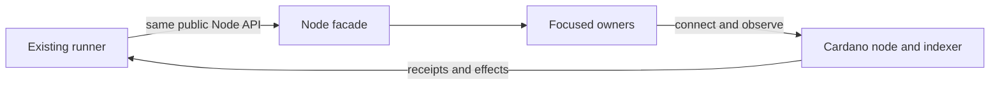

# Separate node responsibilities

As a registry operator, I want the same node modes, wallet, connection,
confirmation, funding and cleanup behavior after their implementations gain
focused owners. Existing commands and tests must keep their Node imports and
their observable transaction behavior.

The intake base is `e2599fe35870fd011cac1d224ef24c052146c859`.
The accepted model source for exits, admission and transaction obligations is
`03fd9e0ec4777a39f40362a8025c48066b0cb597`; the complete Lean tree at
intake is `f1e6a0edcaf9edce7369fd42add8b3677ddabeb2`. The current
constitution is version 1.10.1. This ticket changes representation only.

## Requirements

| ID | Requirement | Observable acceptance |
| --- | --- | --- |
| R266-1 | Give each moved declaration one owner and retain the current `Singular.Registry.Node` exports and named callers. | A complete before and after map, unchanged facade export list and compiled original caller closure. |
| R266-2 | Preserve devnet and external configuration, CLI and environment precedence, network refusal, wallet derivation and key secrecy. | Existing pure Node tests, connection tests and the unchanged command builds pass. |
| R266-3 | Preserve session, follower, funding and address-read lifetimes. Each process global or IORef has one owner, its old initialization point and its old cleanup point. | A global-owner map and compiled execution that observes both normal and exceptional cleanup. |
| R266-4 | Preserve funding, submission, confirmation, protocol-parameter and address-read effects, including the independent observation boundary. | Focused Node suite, fresh-blueprint E2E and bounded journey pass on the candidate; a relevant negative control proves the cleanup test can fail. |
| R266-5 | Explain the ownership graph, flow, invariants, facade, callers and common edit locations to contributors. | Architecture guide, navigation, valid source/generated API links and curated speech pass the active docs and presentation checks. |

## Evidence boundary

Lean remains the behavioral authority for any effect this extraction reaches.
No Lean, validator, wire, Conformance, workflow, public API, release or deployment
change is authorized. The suite may compile unchanged Conformance consumers;
that is a compatibility check, not new Conformance evidence. External-node mode
has no executable public-network coverage in this ticket and remains
unverified there. Issue #249's observed Conformance devnet leak is a separate
open defect; this split does not claim to fix it.
