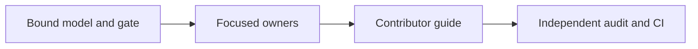

# Node delivery tasks

As an integrator, I need a reviewable candidate whose evidence says precisely
which old behavior was exercised.

## Completion sequence

| Task | Completion evidence | Status |
| --- | --- | --- |
| T266-01 | Intake, original declaration and global maps, model binding, draft PR and frozen gate. | Open |
| T266-02 | Options then wallet extraction, original facade exports and callers retained. | Open |
| T266-03 | Indexing, funding, session and confirmation extraction with one owner per global and unchanged normal and exceptional cleanup. | Open |
| T266-04 | Focused Node behavior and cleanup checks, with a real negative control. | Open |
| T266-05 | Contributor architecture, module/source/API links, navigation, diagram and curated speech. | Open |
| T266-06 | Exact-head gate, fresh-blueprint E2E, journey, unchanged consumer compilation, independent audit and draft PR handback. | Open |
