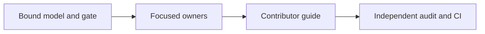

# Node delivery tasks

As an integrator, I need a reviewable candidate whose evidence says precisely
which old behavior was exercised.

```mermaid
flowchart LR
    Plan[Bound model and gate] --> Code[Focused owners]
    Code --> Docs[Contributor guide]
    Docs --> Audit[Independent audit and CI]
```

## Completion sequence

| Task | Completion evidence | Status |
| --- | --- | --- |
| intake-original-declaration-global-maps-model-binding | Intake, original declaration and global maps, model binding, draft PR and frozen gate. | Done |
| options-wallet-extraction-original-facade-exports-callers | Options then wallet extraction, original facade exports and callers retained. | Done |
| indexing-funding-session-confirmation-extraction-one-owner | Indexing, funding, session and confirmation extraction with one owner per global and unchanged normal and exceptional cleanup. | Done |
| focused-node-behavior-cleanup-checks-real-negative | Focused Node behavior and cleanup checks, with a real negative control. | Done |
| contributor-architecture-module-source-api-links-navigation | Contributor architecture, module/source/API links, navigation, diagram and curated speech. | Done |
| exact-head-gate-fresh-blueprint-e2e-journey | Exact-head gate, fresh-blueprint end-to-end, journey, unchanged consumer compilation, independent audit and draft PR handback. | Done |
