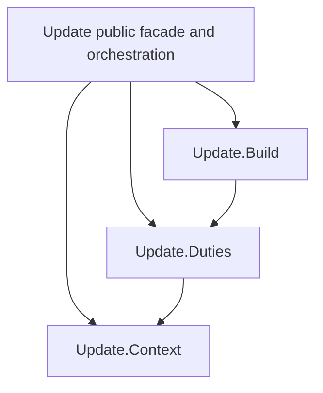

# Fold module ownership

As a contributor, I need one directed path for a fold decision so a future
change cannot create two algorithms that happen to agree today.

| ID | Owner | Responsibility and dependency direction |
| --- | --- | --- |
| registrycontext-its-empty-value-state-request-fee | `Update.Context` | `RegistryContext`, its empty value, state/request/fee lookup, ordered speculative proofs, state output and validity slot. Reads existing Identity, Lookup and trie modules; imports neither Duties nor Build. |
| registryduties-registryduties-one-derivation-mint-approval-holder | `Update.Duties` | `RegistryDuties` and `registryDuties`: one derivation of mint, approval, holder, destination, custody and refund obligations. Reads Context and existing edge/identity modules; imports no Build or facade. |
| noctx-mkevaltx-buildprogram-one-transaction-dsl-assembly | `Update.Build` | `NoCtx`, `mkEvalTx` and `buildProgram`: one transaction story language assembly, evaluation adapter and effect order. Reads Duties; imports no facade. |
| singular-registry-txbuilder-update | `Singular.Registry.TxBuilder.Update` | Retains all six public exports and the two existing update entry points; coordinates the three owners without copying their algorithms. |

Original shipped commands, Driver, Edges, journey, cage end-to-end and burn-source
test callers keep importing `Update` unless a compile dependency requires a
narrow caller change. Cabal declares the children in the existing public
library; no new package or component is introduced.
