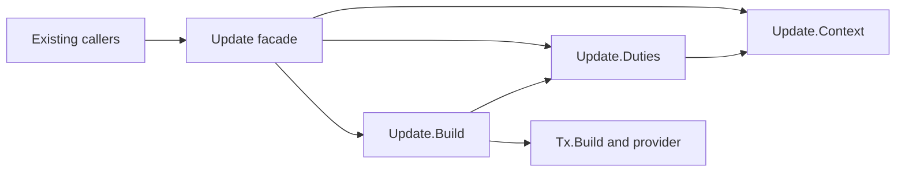

# Fold extraction plan

As a contributor, I need the fold path to be legible from the public caller to
the submitted transaction, with one owner for each decision.

## Ordered work

1. Freeze the six public exports, declaration map, original caller closure,
   accepted Lean tree and #253/#254/#258 merged source surfaces. Record the
   clean supported root-CI baseline and active CI commands.
2. Move context/query/proof/state/slot preparation into `Update.Context`,
   duty types and decisions into `Update.Duties`, and transaction program and
   evaluation adaptation into `Update.Build`. Leave `Update` as the original
   public orchestration and re-export surface. Preserve moved bodies except
   imports, exports and narrowly justified type plumbing.
3. Keep affected existing tests and callers through production entry points.
   Add only a focused behavior-sensitive assertion where an existing control
   leaves an ordering or effect blind spot, and prove that assertion can fail
   for the intended defect.
4. Update the high-level builder guide, navigation if needed, source/generated
   API links and curated speech in the same candidate as the extraction.
   Compare guide claims to the moved source before the expensive campaign.
5. Run the frozen Gate S on the settled clean head, obtain an independent
   exact-candidate audit, bind pushed-head CI, then stamp and hand back the
   draft PR. The epic owner alone accepts and merges.

One cohesive implementation slice covers code, focused control and docs to
avoid a documentation-only second product campaign. Finite execution and
auditor attempt bounds are in the runtime Gate S and worker briefs. Historical
failed charges remain recorded. `Update`'s public API and Conformance bytes
must remain unchanged.
