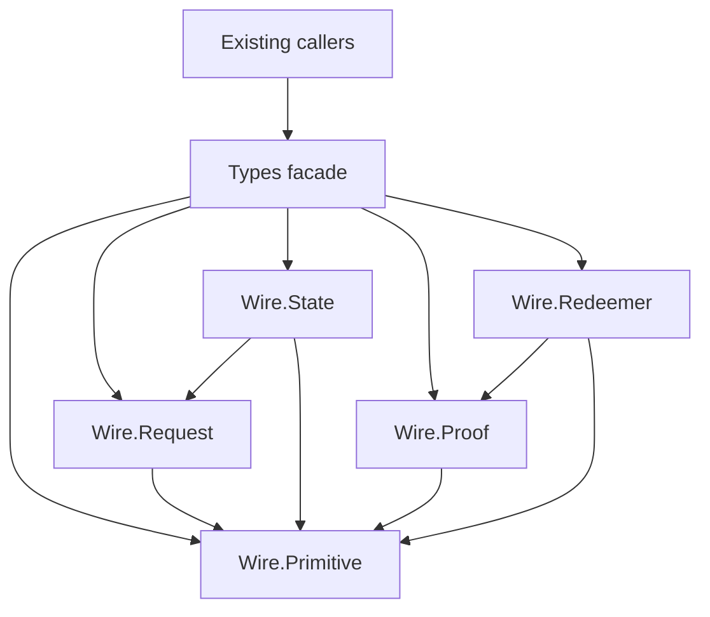

# Owners of registry wire values

As a contributor, I need one directed dependency path from a registry wire value to its codec, so an edit cannot leave two competing definitions or silently bypass the public API.

## Dependency direction

| ID | Module | Responsibility and direction |
| --- | --- | --- |
| singular-registry-wire-primitive | `Singular.Registry.Wire.Primitive` | Token ID, output reference and root values, their codecs, and codec primitives shared by the children. Depends on no sibling. |
| singular-registry-wire-request | `Singular.Registry.Wire.Request` | Edge vocabulary, request and phase values, request codec and phase classification. Reads Primitive only. |
| singular-registry-wire-state | `Singular.Registry.Wire.State` | State and cage datum values with their codecs, and state policy-byte accessors. Reads Primitive and Request. |
| singular-registry-wire-proof | `Singular.Registry.Wire.Proof` | Neighbor and proof-step values with their codecs. Reads Primitive. |
| singular-registry-wire-redeemer | `Singular.Registry.Wire.Redeemer` | Migration, mint and update redeemers, request actions and the hook redeemer, each with its actual instance set. Reads Primitive and Proof. |
| compatibility-facade-exact-original-export-list-owns | `Singular.Registry.Types` | Compatibility facade with the exact original export list; owns no moved data definition or codec body. Re-exports only the named public surface. |

Keep the five owners as package-internal `other-modules` of the existing public library. `Types` remains exposed. Existing callers should continue to import `Types`; a narrow import adaptation is allowed only when compilation demonstrates the need. No owner imports the facade, and no cycle is permitted. The generated API reference documents the internal owners for contributors while clearly distinguishing them from the caller-importable facade.
