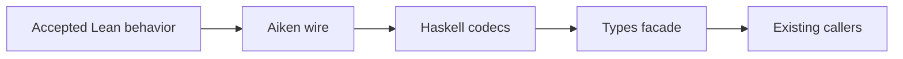

# Keep registry wire values stable while giving them owners

As a registry integrator, I want requests, state, proofs and redeemers to keep their current public constructors and encoded bytes when their Haskell definitions move beside their encoding instances, so existing transactions and callers continue to work.

Intake base: `b77c5b9260531acb754611fce5e4b5975ef54f16`. Its accepted `lean/` tree is `f1e6a0edcaf9edce7369fd42add8b3677ddabeb2`. Relevant authority is `Singular.Model` and the `Singular.Driver` transaction and custody observations, including the refund-only absent custody record. This extraction changes representation only; it grants no new wire ruling.

## Acceptance

| ID | Requirement | Executing or inspected witness |
| --- | --- | --- |
| R268-1 | Each original type, constructor, selector, strict field, helper and instance has exactly one owner; `Singular.Registry.Types` keeps its public exports. | Declaration map in `data-model.md`, source review, Cabal library and supported consumer builds. |
| R268-2 | Every existing encoding, constructor index and field order stays the same, including refund-only custody and the different instance sets. | Independent literal `Data` assertions in `TypesSpec`, existing vector generator against the committed Aiken golden, focused cage tests and Aiken checks. |
| R268-3 | Existing callers, including their observable type use, continue through the `Types` facade. | Full caller inventory at the base and candidate, supported component build, focused suite and fresh-blueprint E2E and journey executions. Source search for type reflection is a lead and must be checked against actual consumers. |
| R268-4 | The new modules are cohesive, acyclic and documented for contributors with a navigable source and generated API reference. | Dependency review, Cabal declaration, source-derived guide and complete generated module/source manifest, rendered links, diagram and synchronized speech checks. |
| R268-5 | Independent evidence boundaries and published conformance state remain intact. | Unchanged Conformance source/receipt/book diff fence, existing Conformance consumers as compatibility checks, and explicit PR limits. |

## Boundary

`Types.hs`, focused `Wire.Primitive`, `Request`, `State`, `Redeemer` and `Proof` modules, the public library Cabal stanza, necessary callers/tests, and directly relevant contributor documentation are owned. The existing `AbsentCustody !ByteString` and `Constr 2 [refund]` are the accepted wire. Issue #178 remains open for its own coverage and publication obligations; this ticket does not migrate that wire or its Conformance rows.

Lean, Aiken, simulator, naming, Conformance source/DSL/receipts/books/workflow, unrelated dependencies, release and deployment are excluded. A required excluded edit becomes one question to the epic owner before any change. A clear code conflict with Lean is repaired inside scope; Lean ambiguity or a bound consumer conflict holds affected acceptance for a user ruling under the constitution.

Evidence claims remain layer specific: literal Haskell `Data` checks and vector comparison establish codec shape; fresh-blueprint execution establishes the exercised off-chain/on-chain path; neither substitutes for a general live-chain or conformance claim.
