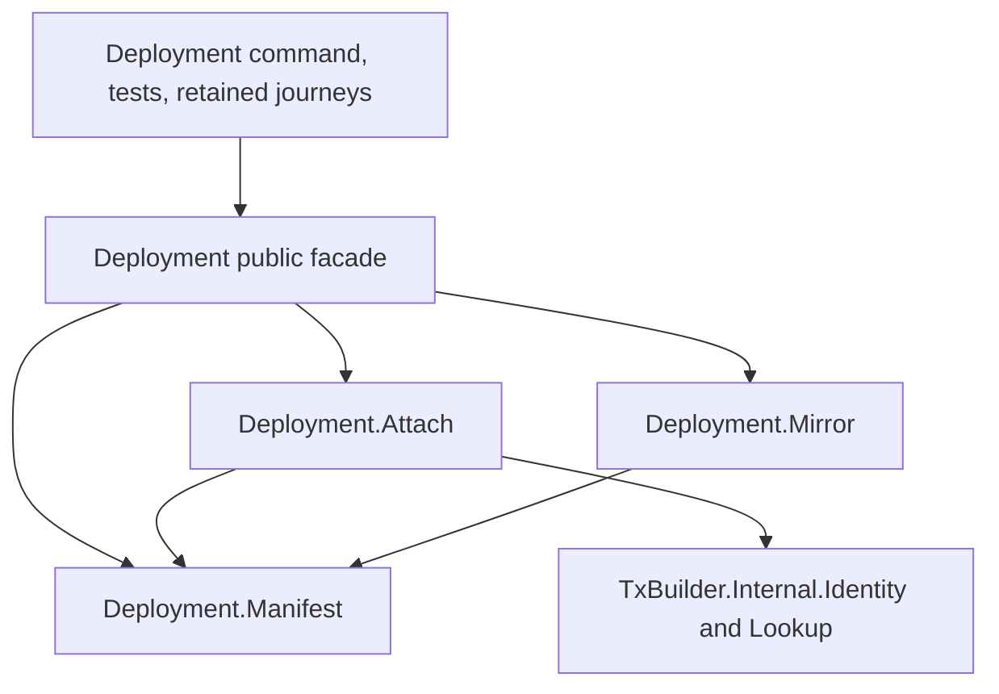

# Deployment module ownership

As a maintainer, I need a directed dependency path from an operator's file through node attachment, so a field or check has one implementation.

## Dependency direction

| ID | Owner | Responsibility |
| --- | --- | --- |
| exact-public-compatibility-exports-haddock-entry-no | `Singular.Registry.Deployment` | Exact public compatibility exports and Haddock entry; no duplicate implementation. |
| manifest-reference-values-json-file-path-option | `Deployment.Manifest` | Manifest/reference values and JSON, file/path/option selection, including `mirrorPathFor`, output-reference/address representations, and shared byte/error rendering. No node query. |
| mirror-values-json-persistent-per-token-mpf | `Deployment.Mirror` | Mirror values, JSON and persistent per-token MPF maps beside the manifest. Reads `mirrorPathFor`, `hex` and `die` from Manifest. No node query. |
| compiled-release-pins-token-derivation-live-reference | `Deployment.Attach` | Compiled-release pins, token derivation, live reference/state output resolution, verification and attachment. Reads manifest values, `parseOutRef`, `hex` and `die` from Manifest and focused identity/lookup/provider adapters. No mirror serializer. |

The three owners are internal library modules and `Deployment` remains exposed. Existing command and test imports keep the facade. The retained journey callers still own their mirror-root comparison; moving that check without an explicit behavior and evidence contract would change the boundary. The generated API documents internal owners for contributors while marking the facade as the caller import.

`verifyDeployment` and `attach` share release and reference resolution but retain distinct live-state behavior. Verification reads the state datum and refuses a mismatched active policy or process/retract window after resolving the state output. Attachment returns that output without those additional checks. Neither owner loads or compares a mirror; the retained journey caller does so after attachment.

The original private helpers each move once: Manifest owns `die` and `hex`; Attach owns `decodeAddrText`, `tokenFor`, `resolveReferenceScripts` and `resolveStateUtxo`. The first two may be exported only to package-internal siblings. `mirrorPathFor` belongs to Manifest, so the diagram's Mirror-to-Manifest edge is an actual import rather than a decorative dependency.
