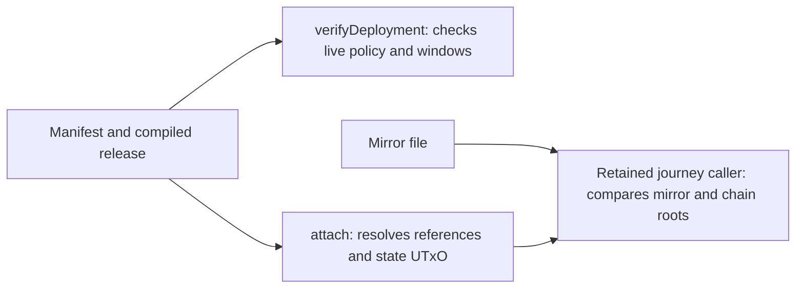

# Separate deployment records from node attachment

As an operator, I record one deployment and attach a later run to it. I want the same manifest bytes, mirror path and contents, node checks, refusal messages and transaction effects after the code is divided into owners.

## Requirements

| ID | Requirement and observable boundary |
| --- | --- |
| R269-01 | The public `Singular.Registry.Deployment` export set, existing callers and command options remain compatible. |
| R269-02 | `Deployment` and `ReferenceScript` JSON keys, pretty output with final newline, strict file read errors, `--deployment` selection, and `txid#index` parsing/rendering remain unchanged. |
| R269-03 | A mirror remains beside its manifest at `.mirror.json`; its JSON keys, hex maps, missing-file behavior and replacement write bytes remain unchanged. |
| R269-04 | Preserve each existing node operation's own query, effect and refusal order. `verifyDeployment` additionally reads the live state datum and checks active policy and process/retract windows; `attach` returns after resolving the state UTxO and does not perform those checks. Neither operation reads a mirror. The extraction does not add a deployment or a network write. |
| R269-05 | A supported executable boundary accepts an intact deployment and rejects a changed script identity with the intended diagnostic. `MISSING-CI-JOB` stays open until a scoped required CI command executes that boundary on the PR head. A setup/build failure is not a refusal witness. |
| R269-06 | Contributor documentation names the owners, dependency direction, actual callers, data flow, invariant and evidence limits, with a diagram, valid generated API and source links, navigation and synchronized speech. |

## Evidence and authority

Base `519058d0f40616e28f7bc7e7940a7ea14ac544aa` contains accepted Lean tree `f1e6a0edcaf9edce7369fd42add8b3677ddabeb2`. `lean/Singular/Model.lean` defines the registry state, transitions, custody and root; the constitution names the concrete trie hash as unobservable. Lean specifies no deployment JSON, file path, node query or mirror persistence behavior. Those concrete representation contracts are pinned by the existing public API, current callers and executable evidence; they cannot be claimed as Lean proofs. Any newly found conflict with clear Lean, or an ambiguous model claim, is escalated as a user story before affected acceptance.

Conformance source, model, validators, simulator, retained legacy journey repairs and release/deployment operations are outside this ticket. Current `deployment-attach-check.sh` depends on retained `register-rows`, `recovery-rows` and `retirement-rows` and is not a passing current receipt.
