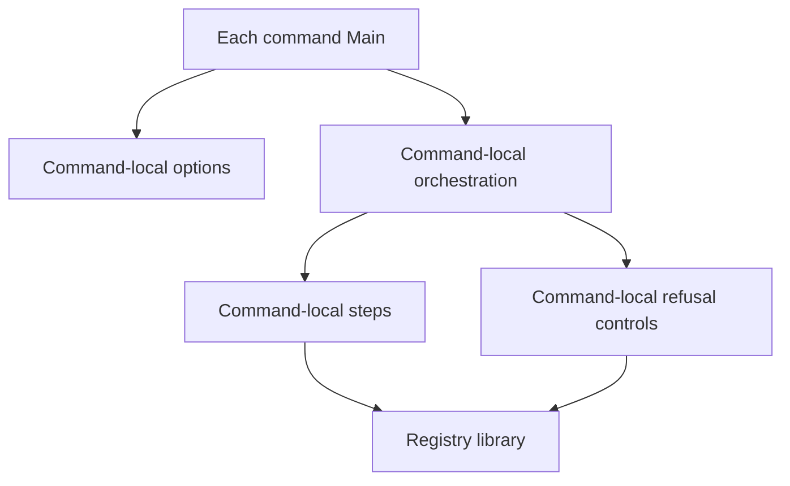

# Active command module owners

As a contributor, I need the command entry points to show which module owns an option, scenario, control and observation while keeping the existing executable boundary.

## Dependency direction

| ID | Owner | Responsibility and direction |
| --- | --- | --- |
| M270-J | `journey/Main.hs` and `journey/` siblings | Main handles outer failure; identity/options, orchestration, scenario steps and deliberate controls each have named local owners. Booking and folding retain separate narration. Siblings may depend on the registry library, never on Main. |
| M270-I | `insert-active/Main.hs` and `insert-active/` siblings | Main handles outer failure; local option/blueprint handling, boot/fold/observation steps and duplicate control are separated. No verifier expectation comes from a builder. |
| M270-U | `update-terminal/Main.hs` and `update-terminal/` siblings | Main handles outer failure; local option/blueprint handling, insert/retire/readback steps and refusals remain distinct. Holder selection and keyed burn stay observable. |
| M270-D | `deployment/Main.hs` and `deployment/` siblings | Main routes four verbs and outer failure; command options, compiled release loading, deploy/verify/count/genesis-skey orchestration and node operations have named local owners. The existing `Singular.Registry.Deployment` library facade remains the caller interface. |

Component-local code may share a helper only when both callers already use the same semantics and the dependency direction is one-way. No command imports a sibling command's scenario or control. The existing `journey/verifier`, `journey/retire-verify` and older naming journeys are independent evidence surfaces and are excluded.
