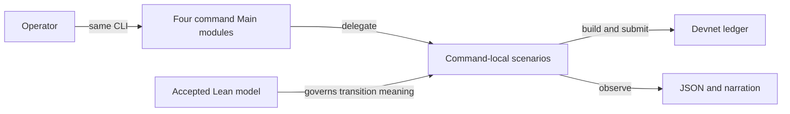

# Small entry points for active registry commands

As an operator, I run the existing journey, insert-active, update-terminal and deployment commands from the supported checkout or archive. I need the same options, exit status, narration, JSON and ledger effects after their large entry files are divided into named owners.

## Requirements

| ID | Observable requirement |
| --- | --- |
| R270-01 | Keep the four executable names, `Main.hs` entry paths, argument and environment parsing, and diagnostic/exit behavior. |
| R270-02 | Keep the journey's ordered narration, including separately narrated booking and folding, its script identity checks, and its positive and refused devnet observations. |
| R270-03 | Keep insert-active's archive-invoked `--observed` JSON fields, one keyed active token at the requested wallet, duplicate refusal and accepting control. |
| R270-04 | Keep update-terminal's archive-invoked `--observed` JSON fields, keyed burn from the holder, distinct roots, Terminal leaf, refusals and accepting controls. |
| R270-05 | Keep deployment's deploy, verify, count and genesis-skey routing; the first non-dash argument selects the verb, and `flagValue` accepts both `--name value` and `--name=value`. Preserve current diagnostics, environment behavior, narration, manifest and ledger effects. |
| R270-06 | Each entry delegates to explicit command, scenario and scenario-control owners; each moved declaration has one implementation and dependencies remain acyclic. Share only demonstrated common infrastructure. |
| R270-07 | Contributor documentation explains responsibility, dependency direction, execution and data flows, invariants, compatibility interfaces, callers, evidence limits and change points with diagrams, source/API links, navigation and synchronized speech. |

## Authority and evidence

Accepted base `b3cbe15e8cd7f9c1b701b9ff7d262c3a89fca8c8` carries Lean tree `f1e6a0edcaf9edce7369fd42add8b3677ddabeb2`. `Singular.step`, `Singular.refusal`, `Singular.txOf` and `Singular.Statements` govern registry transition outcomes and transactions. CLI flags, narration text and observation JSON are concrete command contracts and require command evidence; Lean does not spell those bytes. The constitution requires escalation for a model ambiguity or consumer conflict. No source equivalence or green build alone closes a ledger row.

The checkout journey uses a fresh registry blueprint. The two edge commands are invoked from extracted release archives. These are distinct claims. Journey-from-extracted-archive evidence remains with open #214; #202 owns its driver migration and narration-hook ruling. Conformance source/workflow, Lean, validators, naming, simulator, release publication, deployment actions and retained #172/#283 runners remain outside this ticket.

