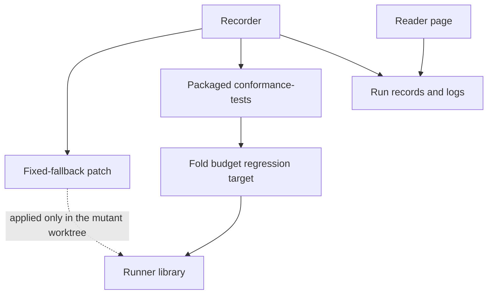

# Components of the fold budget control

As a reviewer, I want each new piece to have one job and depend only downward, so the control cannot leak into the product runner.

## Components

| Component | Path | Responsibility | Depends on |
| --- | --- | --- | --- |
| Fixed-fallback patch | `conformance/review/fold-budget-control/fixed-fallback.patch` | The only mutation: the final fold submission declares the fold's default units instead of the evaluated per-purpose map. It applies to the candidate and is never merged into source. | the runner source it patches |
| Recorder | `conformance/review/fold-budget-control/record` | Builds the blueprint once, makes the mutant commit on a detached worktree, runs the CI command on mutant and candidate, and writes the run records and logs. Its signature is in the functions model. | git, nix, the patch |
| Run records | `conformance/review/fold-budget-control/*.json` and compressed logs | Mechanical output of the recorder. The data model defines their fields. | recorder |
| Reader page | `conformance/review/fold-budget-control/README.md` | States what the pair shows, how to reproduce it and its limits. It is prose around the records and never restates a digest by hand. | run records |
| Regression target, conditional | `conformance/test/fold-budget/**` | Only if the mutant exits 0: a refused honest fold ends the target nonzero. | runner library |

## Direction and placement

The product runner, the CI workflow and the Lean model depend on none of these components. The recorder depends on the patch and on the repository's own packaged app; nothing depends on the recorder. The records sit beside the existing retained runs in `conformance/review/`, which is not part of the published docs site. No abstraction is promoted upstream: there is one consumer.

Field definitions are in the data model, and the recorder's call shape is in the functions model.
