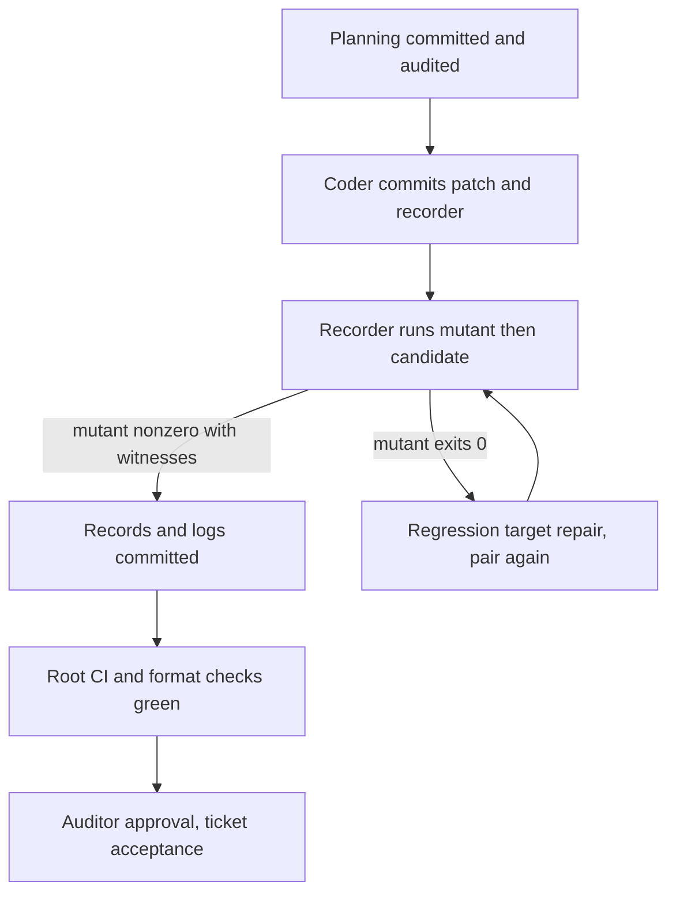

# Plan for the fold budget control

As the ticket owner, I want one recorded control pair from the real CI command, a fixed-fallback mutant failing and the restored candidate passing, retained where a reviewer can check it.

## Status

Completed: planning, the control candidate (dfd4ac1), the retained pair (a6172e0) and every checkpoint review.
Current: ticket-owner acceptance and the final gate on the stamped head.
Blockers: none. Publication is held for a separate decision.

## Constitution check

| Principle | Disposition |
| --- | --- |
| Lean is the authority | No Lean, corpus or expected result changes. Execution units are the named unobservable `scriptExecutionUnits`, so the pair is ledger and harness evidence. |
| Model questions become user stories | None arises: the control changes no outcome the model states. |
| Verify the whole claim | The RED runs the CI command against a rebuilt runner and observes a node refusal at the ledger boundary. A source search, an allocator unit test or the fixture's own refusal does not stand in. |
| Preserve evidence and gaps | Both runs are retained with digests. The #273 acceptance record and the #281 evidence are untouched, and the published limits say what the pair does not show. |
| Previous work | The existing wiring is kept. If the mutant passes, the regression target is repaired forward. |
| Public evidence statement | No public conformance page changes. The reader page for the pair lives with the other retained runs. |

## Delivery

1. Planning: these artifacts, committed by the ticket owner. The online auditor reviews them before any coder work.
2. Control: the coder commits the mutation patch, the recorder and the reader page. This is the candidate the pair runs against.
3. Pair: the recorder builds the blueprint once and makes the mutant commit on a detached worktree. It runs the CI command on the mutant, then on the candidate, and writes both records and logs.
4. Repair, only if the mutant exits 0: the coder repairs the fold budget test target so that a refused honest fold ends it nonzero, commits, and runs the pair again against that candidate.
5. Retention: the coder commits the records and logs. That commit touches only the retained evidence directory.
6. Gate: root local CI, plus the Conformance format and lint checks when Haskell changed. Then auditor approval at each checkpoint, and ticket-owner acceptance.

## Team and authority

The operator approved this roster on 2026-09-30. The ticket owner is Claude Opus 5.5 at high effort and writes planning, gates and acceptance. The coder is Claude Sonnet 5.5 at high effort and owns the patch, the recorder, any repair, the evidence and their commits. The online auditor is Codex gpt-6.1-sol at high effort. It reviews committed checkpoints through the ticket owner and never talks to the coder. No push, pull request, issue change, merge or release is authorized.

## Gate

| Row | Command | Where | Expected |
| --- | --- | --- | --- |
| Mutant | `REGISTRY_BLUEPRINT=<bp> nix run --quiet .#conformance-tests` | `conformance/` of the mutant commit | nonzero, with the four ordered fixed-fallback-mutant-candidate-exactly-one-committed witnesses |
| Restored | the same command | `conformance/` of the candidate | 0, with the same-command-on-clean-candidate-evaluated-declaration witnesses |
| Identity | `git diff <candidate> <mutant>` against the committed patch; record agreement on blueprint, genesis, node, command and environment | recorder output | equal |
| Root CI | `nix develop --quiet -c just ci` | repository root at the final head | 0 |
| Format | `nix run --quiet .#format-check` | `conformance/` | 0 |
| Lint | `nix run --quiet .#hlint-check` | `conformance/` | 0 |

The first three rows are this ticket's; the rest are the repository's CI commands. The fixture refusal alone, a compile failure or a setup failure never satisfies the mutant row.

## Execution accounting

The budget is unlimited, but every invocation is counted from receipts. Expensive means Nix builds, devnet runs and the root CI. Cheap means scratch compiles and file checks. The recorder writes one receipt per invocation, nested builds included. An unchanged failure is diagnosed before it is retried.

## Stop conditions

The coder stops and files a question when the patch would touch more than the per-purpose declaration, would disable or weaken any check, or when a mutant failure has another cause. It also stops when the repair would leave the test target, when a raw log exceeds 5 MiB, or when a model or constitution question appears. The ticket owner escalates model questions as user stories to the epic owner.

## Evidence limits

The pair shows one candidate's CI command failing on one fixed-fallback mutant and passing when restored. It does not re-check future candidates, so a later change to the target is not controlled until someone re-runs the recorder. It establishes no Lean fact about execution units. The run is local; CI evidence on a published head is a later, separate step.
