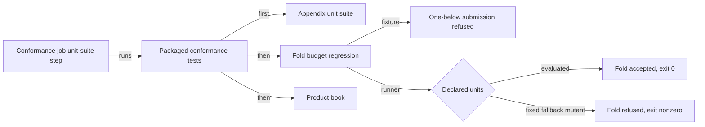

# Show the fold budget regression can fail in CI

As a registry integrator, I need evidence that the conformance job's own command fails when the runner stops declaring script budgets from node evaluation and falls back to a fixed guess that is too small. The same command must succeed once the evaluated declaration is restored. Then a green conformance job tells me honest folds are budgeted by measurement, not by luck.

## Requirements

| ID | Observable requirement |
| --- | --- |
| R280-01 | A fixed-fallback mutant is the candidate with exactly one committed change: the runner's per-purpose declaration, which it assembles, checks and submits, becomes the fold's default units for every script purpose instead of the evaluated allocation. The fixture sets those default units to its fixed fallback. Evaluation still runs, and the runner's check that the assembled transaction carries its declaration stays in force. The conformance job's unit-suite command, run on that mutant with the candidate's validator blueprint, exits nonzero. Its log shows the appendix unit suite passing, the fixture's one-below-measured submission refused, then the runner's own submission of the same fold refused by the node and attributed by the runner to execution budget, with the over-declared purposes named, and the fold budget regression reporting failure. The product book is not reached. |
| R280-02 | The same command on the clean candidate, with the evaluated declaration in place and the same blueprint, genesis and node, exits 0. Its log shows the fixture refusal, the regression's success line and the book completing. |
| R280-03 | Every run record is produced by the recorder, never typed. It binds the source commit and tree, the clean or dirty state, the Lean model tree and driver corpus digest, the blueprint path and digest, the genesis digest, the node version, the exact command and environment, start and end times, the real exit status, and the raw log digest and size. The mutant differs from the candidate by exactly the committed patch, and the restored run executes the candidate itself. |
| R280-04 | The patch, the recorder, the two run records and the raw logs are retained in the repository under `conformance/review/fold-budget-control/`, with a reader page stating what the pair shows and what it does not. |
| R280-05 | Nothing else changes: the CI workflow, the product runner's behavior, the Lean model, the public conformance pages and every other row stay as they are, and the repository's local CI stays green. |
| R280-06 | If the mutant command exits 0, the regression cannot fail on the defect it names. The repair is then confined to the fold budget test target, so that a refused honest fold ends that target nonzero. The same pair is then run again on the repaired candidate. |

## Acceptance

- The mutant run's exit is nonzero and its log carries all four witnesses of R280-01 in order. A compile, setup, network, devnet start or differently attributed refusal is recorded as such and is not a RED.
- The restored run's exit is 0 with the R280-02 witnesses. The two records agree on blueprint digest, genesis digest, node version, command and environment, and differ in source commit only by the patch.
- `nix develop --quiet -c just ci` at the repository root exits 0 on the candidate, and so do the Conformance Haskell format and lint checks when a Haskell file changes.

## Clarifications

The issue's premise is stale and is not re-opened. It asked for a CI step that runs `fold-budget-regression`, but the conformance job already runs it: its unit-suite step calls the packaged `conformance-tests` app, which runs the regression before the book. No duplicate step is added.

The fixture's own refused submission is expected behavior inside a passing command. It is not the RED this ticket needs. The RED is the whole command failing because the runner itself declared too little.

The blueprint is built once from the candidate and passed as `REGISTRY_BLUEPRINT`, which is exactly what the app computes when the variable is absent. This binds both runs to one validator build.

The control is a retained pair bound to one candidate, not a permanent CI step. A second devnet run in every job would duplicate the conformance job, which the ticket excludes.

Execution units are unobservable in the model (`scriptExecutionUnits`), so this is ledger and harness evidence. No Lean statement is added or changed.

No question is open.

## Authority and evidence

Base `24ecba3f02840424c65b68bf391fccb61b43ea2f` carries constitution 1.11.0. The Lean model tree is `aa1cdec1a72f2a01597075862fc304aa389c4d52`, and the driver corpus digest is `208fda7c277e5495f9cdc6efd50f320cc0c7323f315d4a1d5cb899fd149cb8ca`. Issue #273 added the regression target, and its acceptance record is preserved, not relabelled. CI run 36622422829 at PR 316 shows the ordinary regression passing, which is not a control.

