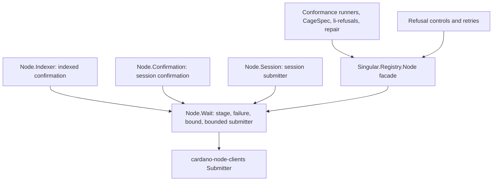

# Wait bound module owners

As a maintainer, I need one module to own what a bounded wait is and how its failure reads, with every waiting site depending on it and nothing depending back.

## Dependency direction

| ID | Owner | Responsibility and direction |
| --- | --- | --- |
| M281-W | `Singular.Registry.Node.Wait`, new in the `node-internal` library | Owns the wait stages, the named wait failure, the whole-wait bound, the bounded submitter and the wait-aware catch. It depends only on base libraries, the ledger transaction identity and the client `Submitter` interface, never on another Node module. |
| M281-I | `Singular.Registry.Node.Indexer` | Indexed confirmation runs under the wait bound. Its old window message path is deleted, not kept beside the new one. The call outside a followed chain keeps its existing refusal. |
| M281-C | `Singular.Registry.Node.Confirmation` | Session confirmation runs its entire wait, including tip reads, under the wait bound; the tip deadline stays as an earlier end. |
| M281-S | `Singular.Registry.Node.Session` | The session's submitter is the bounded submitter over the node submitter. |
| M281-F | `Singular.Registry.Node` facade | Re-exports the wait failure, stages, submission bound and bounded submitter for runners outside `node-internal`. |
| M281-R | Construction sites in `conformance/app/Conformance/Run.hs`, `Run/CsRows.hs`, `Run/ForkProbe.hs`, `offchain/e2e-test/.../CageSpec.hs`, `offchain/journey/li-refusals`, `offchain/journey/repair` | Each builds its node submitter through the bounded submitter. `Conformance.Run.Submit` keeps its connection-lost retry and lets a wait failure propagate unretried. |
| M281-K | Exception classifiers that reach a submission or confirmation: the conformance cage boot retry (`Conformance.Run.Cage`), the insert-active and update-terminal refusal controls, and the E2E specs that catch a fold failure | Each catches through the wait-aware catch owned by M281-W, so a wait failure is neither published as a refusal or control outcome nor retried. The complete inventory is discovered from source, and each site is listed with its disposition in the implementation receipt. |
| M281-T | `offchain/test` cage-tests suite | One new spec module holds the negative and positive checks for the three waits; it is registered in the suite. |

No other module gains a timeout of its own. A second bounding mechanism would be a defect.
