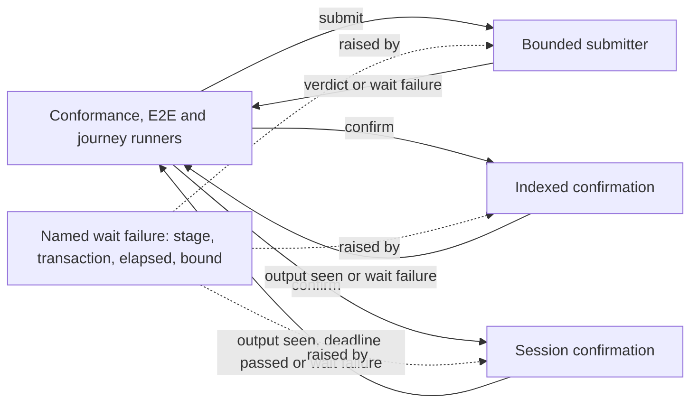

# Bounded submission and confirmation

As a conformance or end-to-end operator, I need any wait on a submitted transaction to end within a known time with a failure that names the transaction and the elapsed time. That covers a submission the node never decides, a transaction that never reaches a block, and a confirmation watching a chain that has stopped. A stalled node then costs minutes instead of a manual interrupt, and it is never mistaken for a ledger refusal or an acceptance.

## Requirements

| ID | Observable requirement |
| --- | --- |
| R281-01 | A submission that receives no node verdict fails within the finite submission bound, as the named wait failure carrying the transaction id and the measured elapsed time. It is never reported as rejected or accepted. A prompt verdict passes through unchanged. Every runner that constructs a node submitter submits only through the bounded one. |
| R281-02 | Waiting for the followed indexer to show a submitted transaction's first output fails within its window when that output never appears, as the named wait failure with the transaction id and elapsed time. An executed check with a short injected window over a real in-memory indexer shows this. |
| R281-03 | A node-session confirmation (by transaction, by id, or by validity window) fails within a finite wall-clock limit when the chain tip stops advancing and when any node read it makes never returns. That includes the reads that compute its window. The whole wait obeys the limit, not only each poll. The failure names the transaction and the elapsed time. A tip passing the existing deadline still ends the wait earlier, as the same named wait failure. |
| R281-04 | Prompt verdicts and observations return exactly as before. The production windows stay: 300 seconds for indexed confirmation, and the validity upper bound plus two minutes for session confirmation. Every existing check stays green. |
| R281-05 | When a bound fires, the waiting thread and any helper it started are cancelled or released. No thread is left holding the process open, and no asynchronous exception is masked. |
| R281-06 | No bound becomes a refusal receipt, a conformance row outcome, a published refusal or control outcome, or an acceptance. Every site that catches an exception and classifies it as a refusal, a control outcome or a reason to retry lets the wait failure pass unclassified and unretried. A wait failure ends the run as infrastructure failure. |

## Authority and evidence

Base a0770318f5037e79e815e7831cfa539213f2853e carries constitution 1.11.0 and the Lean model unchanged. A bound on a wait is runner infrastructure: no Lean definition, outcome class or judgement changes, and none is reported as `refused`, `accepted` or `unsupported`.

The historical run (issue #281) stopped after its unit report and printed no submission verdict. The harness was therefore waiting for the node's LocalTxSubmission answer, which the pinned client awaits without a bound. The indexed wait already had a 300 second window that no check had ever executed. The session confirmation ends only when the tip passes a deadline, which a stopped chain never reaches.

