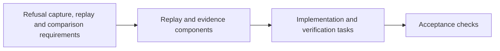

# Analysis: cross-artifact consistency

Run after `tasks.md`, over spec, research, plan, the three models, contract,
quickstart, checklist and tasks at this commit.

## Coverage

| Requirement | Model | Tasks | Gate |
|---|---|---|---|
| capture-refused-transaction capture | conformance-run-replay, replaycapsule | capturecapsule-at-validator-rejection-driver-steps, run-retire-active-key-reject-retract | retirement-refund-window-reasons, registration-and-attribution-reasons, complete-refusal-extent |
| traced-validator-build traced build | build-traced-registry-blueprint-from-onchain-build | traced-blueprint-output-from-onchain-packages | toolchain-correspondence-check |
| toolchain-correspondence toolchain | build-traced-registry-blueprint-from-onchain-build, tracedprovenance-output-read-by | red-correspondence-check-fails-on-base, correspondence-check-untraced-rebuild-reproduces-onchain | toolchain-correspondence-check |
| matching-script-parameters parameters | conformance-run-replay | applydeployedparameters-parameters-mismatch-untraced-application-does | conformance-suite |
| matching-ledger-context same context | conformance-run-replay | read-pinned-cardano-node-clients-offchain, purposearguments-from-capsule-through-seam | conformance-suite, retirement-refund-window-reasons |
| deployed-refusal-reproduction deployed reproduction | conformance-replay, conformance-run-replay, replayclass | red-table-driven-unit-cases-for, evaluatebytes-replayrefusal-capsule-files-per-contracts | conformance-suite, retirement-refund-window-reasons |
| single-observed-trace reason | conformance-replay, replayclass | red-table-driven-unit-cases-for, conformance-replay-turns-green | conformance-suite |
| separate-evidence-classes classes | conformance-replay, replayclass | red-table-driven-unit-cases-for | conformance-suite |
| compare-observed-refusal-reasons comparison | conformance-replay, changed-signatures, reasoncomparison | red-refused-refused-step-differing-admitted | conformance-suite, retirement-refund-window-reasons, wrong-reason-failing-control |
| classify-refusal-comparison-extent extent classes | conformance-refusal-attribution-callers, `extent.md` | from-receipts-replay-index-discover-complete, attribution-rows-fill-branch-from-admitted | registration-and-attribution-reasons, complete-refusal-extent |
| self-contained-replay-receipt receipt | serialize-load-replay-fields-decided-by-q | receipt-replay-object-data-model-written | retirement-refund-window-reasons, registration-and-attribution-reasons (after operator question (Q-001)) |
| wrong-reason-control wrong-reason control | wrong-reason-control-one-row-one-step | wrong-reason-control-mode-unit-red, control-step-altered-leg-non-zero-naming | wrong-reason-failing-control |
| accepting-replay-control accepting control | conformance-run-replay, contract index | accepting-control-per-refusing-script-role | complete-refusal-extent |
| discovered-refusal-extent extent | github-workflows-conformance-yml | extent-over-receipt-non-empty-guard-refusal | complete-refusal-extent |
| book-states-observation-limits book | restate-limit-text-enforces-its-condition-until | restate-limit-in-conformance-book-method–update-conformance-story-usage-restated-text | root-checks, conformance-suite |
| replay-change-boundary fence | plan owned paths | every slice | deployed-hashes-unchanged and the path diff |

Every requirement has a model row, a task and a gate row; no task lacks a
requirement.

## Findings

| # | Severity | Finding | Disposition |
|---|---|---|---|
| A1 | high | self-contained-replay-receipt conflicts between the issue's wording and the packet's wire freeze | operator ruling 2026-10-01: one self-contained receipt; additive optional replay object (self-contained-replay-receipt); R3b released |
| A2 | medium | Constitution, `docs/theorems.md` and an onchain comment state the limit outside the fence | operator answer (A-002): fence holds; residual-after-evidence residual after evidence (prepare-residual-for-epic-from-evidence) |
| A3 | medium | The ledger seam (conformance-run-replay `purposeArguments`) is a lead, not verified at the pin | read-pinned-cardano-node-clients-offchain first; failure is a placement challenge |
| A4 | medium | book-states-observation-limits's condition cannot be derived by the book until #225; it is enforced by CI (complete-refusal-extent) | stated in book-states-observation-limits and restate-limit-text-enforces-its-condition-until |
| A5 | low | The deployed-trace premise is unverified; a byte search could not settle it (reason names are data values) | premise-run-on-retract-outside-window stops the campaign if false |
| A6 | low | Reason vocabulary: Lean returns reasons as strings, with no enumeration to validate against | single-observed-trace takes the single user trace verbatim; compare-observed-refusal-reasons compares it with Lean's reason for that step |
| A7 | low | retirement-refund-window-reasons–complete-refusal-extent are CI changes in this ticket; falsified by the base's missing reasons and the control's altered leg, proved by the pushed head's CI | plan gate note |
| A8 | high | The denominator was first read as driver-compared steps only; epic operator note (NOTE-001) rules every live refusal in, classified against Lean itself | classify-refusal-comparison-extent, discovered-refusal-extent, book-states-observation-limits amended; `extent.md`; from-receipts-replay-index-discover-complete |
| A9 | high | reject-before-deadline-consumer-requirement (phase-1 reject): Lean admits every reject, the chain refuses before the retract window closes | operator question (Q-003); operator answer (A-003) hold; operator ruling 2026-10-01 (operator answer (A-010)): Lean kept, validator repaired in a predecessor; reject-before-deadline-consumer-requirement unmet until it lands and the build correspondence is rebound | operator ruling 2026-10-01: Lean kept, validator repaired in a predecessor; reject-before-deadline-consumer-requirement unmet until it lands |
| A10 | high | Review 001: a differing or unobserved reason reached no durable record, because the runner throws before writing and rows require agreement first | compare-observed-refusal-reasons, reasoncomparison, contract index, red-refused-refused-step-differing-admitted name the sites; index written before the row acts |
| A11 | high | Review 001: the accepting control had no failing CI command | accepting-replay-control through the index; complete-refusal-extent requires it; accepting-control-per-refusing-script-role |
| A12 | high | Review 002: the extent label selected whether a refusal must agree, so a driver-compared refusal labelled B, C or D escaped the check | Class A is the mechanical fact of an executed model reason; B/C/D only from the committed table; unclassified fails (classify-refusal-comparison-extent, discovered-refusal-extent, complete-refusal-extent, extent-over-receipt-non-empty-guard-refusal) |

## Terminology

"Chain-side reason" is the admitted traced reason only; "unobserved" always
carries a replayclass cause; "attribution row" means a row whose runner only attributes its refusal, which says nothing about whether Lean gives a reason; the extent classes (`extent.md`) say that.
Used identically across spec, models and tasks.

## Size

Artifact lines and bytes are measured at commit and reported in the ticket
owner's journal; plan.md stays under 200 lines.
