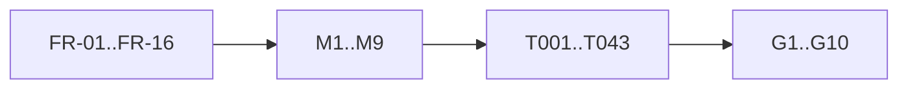

# Analysis: cross-artifact consistency

Run after `tasks.md`, over spec, research, plan, the three models, contract,
quickstart, checklist and tasks at this commit.

## Coverage

| Requirement | Model | Tasks | Gate |
|---|---|---|---|
| FR-01 capture | M3, D1 | T022, T027 | G6, G7, G10 |
| FR-02 traced build | M1 | T011 | G8 |
| FR-03 toolchain | M1, D2 | T010, T012 | G8 |
| FR-04 parameters | M3 | T024 | G2 |
| FR-05 same context | M3 | T001, T023 | G2, G6 |
| FR-06 deployed reproduction | M2, M3, D5 | T020, T025 | G2, G6 |
| FR-07 reason | M2, D5 | T020, T021 | G2 |
| FR-08 classes | M2, D5 | T020 | G2 |
| FR-09 comparison | M2, M4, D6 | T030 | G2, G6, G9 |
| FR-10 extent classes | M5, `extent.md` | T028, T031 | G7, G10 |
| FR-11 receipt | M6 | T032 | G6, G7 (after Q-001) |
| FR-12 wrong-reason control | M8 | T033, T037 | G9 |
| FR-13 accepting control | M3, contract index | T034 | G10 |
| FR-14 extent | M9 | T038 | G10 |
| FR-15 book | M7 | T040–T042 | G1, G2 |
| FR-16 fence | plan owned paths | every slice | G5 and the path diff |

Every requirement has a model row, a task and a gate row; no task lacks a
requirement.

## Findings

| # | Severity | Finding | Disposition |
|---|---|---|---|
| A1 | high | FR-11 conflicts between the issue's wording and the packet's wire freeze | Q-001; R3 receipt tasks held |
| A2 | medium | Constitution, `docs/theorems.md` and an onchain comment state the limit outside the fence | A-002: fence holds; D287-DOC residual after evidence (T043) |
| A3 | medium | The ledger seam (M3 `purposeArguments`) is a lead, not verified at the pin | T001 first; failure is a placement challenge |
| A4 | medium | FR-15's condition cannot be derived by the book until #225; it is enforced by CI (G10) | stated in FR-15 and M7 |
| A5 | low | The deployed-trace premise is unverified; a byte search could not settle it (reason names are data values) | T026 stops the campaign if false |
| A6 | low | Reason vocabulary: Lean returns reasons as strings, with no enumeration to validate against | FR-07 takes the single user trace verbatim; FR-09 compares it with Lean's reason for that step |
| A7 | low | G6–G10 are CI changes in this ticket; falsified by the base's missing reasons and the control's altered leg, proved by the pushed head's CI | plan gate note |
| A8 | high | The denominator was first read as driver-compared steps only; epic NOTE-001 rules every live refusal in, classified against Lean itself | FR-10, FR-14, FR-15 amended; `extent.md`; T028 |
| A9 | high | CG09 (phase-1 reject): Lean admits every reject, the chain refuses before the retract window closes | Q-003; A-003: D287-REJECT, an epic-owned affected-acceptance hold; CG09 held in class D, comparison unmet |
| A10 | high | Review 001: a differing or unobserved reason reached no durable record, because the runner throws before writing and rows require agreement first | FR-09, D6, contract index, T030 name the sites; index written before the row acts |
| A11 | high | Review 001: the accepting control had no failing CI command | FR-13 through the index; G10 requires it; T034 |
| A12 | high | Review 002: the extent label selected whether a refusal must agree, so a driver-compared refusal labelled B, C or D escaped the check | Class A is the mechanical fact of an executed model reason; B/C/D only from the committed table; unclassified fails (FR-10, FR-14, G10, T038) |

## Terminology

"Chain-side reason" is the admitted traced reason only; "unobserved" always
carries a D5 cause; "attribution row" means a row whose runner only attributes its refusal, which says nothing about whether Lean gives a reason; the extent classes (`extent.md`) say that.
Used identically across spec, models and tasks.

## Size

Artifact lines and bytes are measured at commit and reported in the ticket
owner's journal; plan.md stays under 200 lines.
