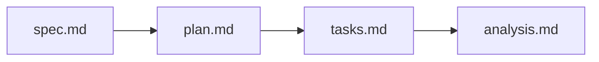

# Requirements checklist: traced refusal reasons

- [x] Every story has actor, action and observable outcome (S1–S3).
- [x] Every requirement is observable and can fail (FR-01–FR-16; gate G1–G10).
- [x] Evidence classes kept apart; non-evidence listed (FR-08).
- [x] The comparison has a wrong-reason control and a restored pass (FR-12, G9).
- [x] The extent is counted from receipts with a non-empty guard (FR-14, G10).
- [x] Unobserved reasons stay visible; the limit drops only under FR-14 (FR-15).
- [x] Same transaction: no resubmission or rebuilt context; deployed replay
      links chain and traced run (FR-05, FR-06).
- [x] Same source and toolchain proved by rebuild, not by prose (FR-03).
- [x] Fence: no edit to onchain, naming-onchain, applications, Lean, corpus,
      constitution, deployed bytes (FR-16).
- [ ] Receipt fit ruled (Q-001).
- [ ] Texts outside the fence that state the limit ruled (Q-002).
- [x] No implementation detail in the spec beyond named existing artifacts.
