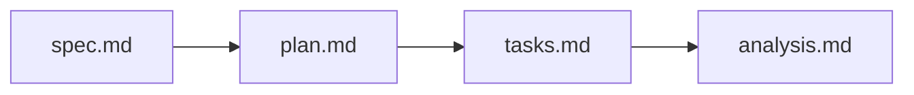

# Requirements checklist: traced refusal reasons

- [x] Every story has actor, action and observable outcome (reason-observed-live-step-model-refuses-reason–honest-limits-refusal-whose-replay-cannot-produce).
- [x] Every requirement is observable and can fail (capture-refused-transaction–replay-change-boundary; gate root-checks–complete-refusal-extent).
- [x] Evidence classes kept apart; non-evidence listed (separate-evidence-classes).
- [x] The comparison has a wrong-reason control and a restored pass (wrong-reason-control, wrong-reason-failing-control).
- [x] The extent is counted from receipts with a non-empty guard (discovered-refusal-extent, complete-refusal-extent).
- [x] Unobserved reasons stay visible; the limit drops only under discovered-refusal-extent (book-states-observation-limits).
- [x] Same transaction: no resubmission or rebuilt context; deployed replay
      links chain and traced run (matching-ledger-context, deployed-refusal-reproduction).
- [x] Same source and toolchain proved by rebuild, not by prose (toolchain-correspondence).
- [x] Fence: no edit to onchain, naming-onchain, applications, Lean, corpus,
      constitution, deployed bytes (replay-change-boundary).
- [ ] Receipt fit ruled (operator question (Q-001)).
- [x] Texts outside the fence that state the limit ruled (operator answer (A-002): fence holds; residual-after-evidence residual after evidence).
- [x] Every live refusal in the denominator, classified against Lean (`extent.md`).
- [ ] reject-before-deadline-consumer-requirement phase-1 reject conflict ruled (operator question (Q-003); operator answer (A-003) holds it as comparison-unmet, comparison unmet).
- [x] A differing or unobserved reason leaves durable evidence; the accepting control has a failing CI check (review 001).
- [x] No implementation detail in the spec beyond named existing artifacts.
