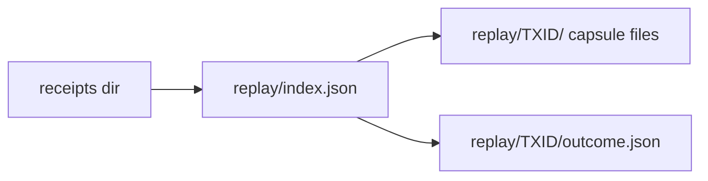

# Contract: replay evidence files

Written by `Conformance.Run.Replay` beside a run's receipts; uploaded with the
`conformance-receipts` artifact. Harness evidence: the book cites it in its
appendix, never in its body.



## Layout

```text
<receipts-dir>/replay/index.json
<receipts-dir>/replay/<rejectedTxId>/transaction.cbor
<receipts-dir>/replay/<rejectedTxId>/resolved.cbor
<receipts-dir>/replay/<rejectedTxId>/protocol-parameters.json
<receipts-dir>/replay/<rejectedTxId>/era.json          # system start, era history
<receipts-dir>/replay/<rejectedTxId>/outcome.json
```

## `outcome.json`

```text
{ "rejectedTxId", "captureId", "node",
  "provenance": { "source", "compiler", "flags" },
  "purposes": [ { "purpose", "index", "deployedHash", "tracedHash",
                  "deployed": { "bytesHash", "budgetLimit", "budgetUsed", "outcome", "logs" },
                  "traced":   { "bytesHash", "budgetLimit", "budgetUsed", "outcome", "logs" },
                  "class": { "admitted": "<reason>" } | { "unobserved": "<cause>" } } ] }
```

`logs` holds each run's log lines verbatim, bounded; the deployed run's
logs are kept for T026's premise evidence.

## `index.json`

One entry per rejection in the order the run met them:
`{ "rejectedTxId", "captureId", "row", "step" | null, "classes": [...] }`.
The CI extent (G10) counts refused steps from receipts and requires each to
appear here exactly once.

## Obligations

- `captureId` is recomputed by the loader and must match.
- A file is never rewritten after `captureId` is computed.
- Missing capsule files make every class of that rejection `capture-incomplete`.
- Receipt-side fields are fixed by Q-001; this contract does not change the
  receipt.
