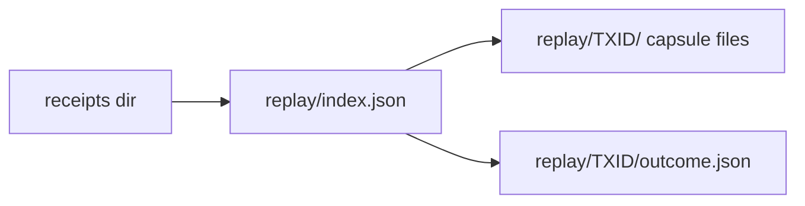

# Contract: replay evidence files

Written by `Conformance.Run.Replay` beside a run's receipts; uploaded with the
`conformance-receipts` artifact. Harness evidence: the book cites it in its
appendix, never in its body.



## Layout

```text
<receipts-dir>/replay/index.json
<receipts-dir>/replay/<rejectedTxId>/transaction.cbor
<receipts-dir>/replay/<rejectedTxId>/resolved.cbor
<receipts-dir>/replay/<rejectedTxId>/protocol-parameters.json
<receipts-dir>/replay/<rejectedTxId>/era.json          # system start, era history
<receipts-dir>/replay/<rejectedTxId>/outcome.json
```

## `outcome.json`

```text
{ "rejectedTxId", "captureId", "node",
  "provenance": { "source", "compiler", "flags" },
  "purposes": [ { "purpose", "index", "deployedHash", "tracedHash",
                  "deployed": { "bytesHash", "budgetLimit", "budgetUsed", "outcome", "logs" },
                  "traced":   { "bytesHash", "budgetLimit", "budgetUsed", "outcome", "logs" },
                  "class": { "admitted": "<reason>" } | { "unobserved": "<cause>" } } ] }
```

`logs` holds each run's log lines verbatim, bounded; the deployed run's
logs are kept for T026's premise evidence.

## `index.json`

One entry per node rejection and per accepting control, in the order the run
met them:
`{ "kind": "refusal" | "accepting-control", "rejectedTxId" | "acceptedTxId",
"captureId", "row", "step" | null, "role", "classes": [...], "extentClass" (A written by the runner exactly when "modelReason" is present; B, C or D read from `extent.md`'s committed table; otherwise "unclassified"),
"modelReason" | null, "comparison": "agrees" | "differs" | "uncompared" | null }`.
The entry is written, with its comparison, before the runner acts on the
comparison, so a failing row keeps it. The CI extent (G10) counts refusals from
receipts and index together and requires each exactly once, and requires, for
every role that refused, one accepting-control entry whose deployed and traced
runs both succeeded.

## Offline correction

A capsule replayed offline (`replay-capsule`, T029c) writes
`replay-offline/<rejectedTxId>/outcome.json` beside the receipts it came from,
with the recomputed `captureId`, the blueprints used and the command; the
original `replay/<rejectedTxId>/outcome.json` stays byte-identical.

## Offline compiler diagnostic (T036b)

`replay-diagnostic/<rejectedTxId>/outcome.json`, written only by
`replay-capsule --diagnostic`: per purpose left `no-user-trace`,
`{ purpose, deployedHash, diagnosticHash, outcome, logs }` and
`kind: "compiler-diagnostic"`, with the diagnostic build's provenance. It has no
`reason` or `admitted` key, is never read by admission, comparison, the
receipt or the index, and never overwrites `replay-offline`.

## Obligations

- `captureId` is recomputed by the loader and must match.
- A file is never rewritten after `captureId` is computed.
- Missing capsule files make every class of that rejection `capture-incomplete`.
- In CI, every step that runs a row publishes its receipts path to the
  always-run artifact upload before the row runs, so a failing row's
  `replay/` directory is uploaded with the original failure preserved (T039).
- The receipt itself names both hashes, the reason or cause and the capture
  identity (data-model "Receipt replay object"); these files are its
  supporting proof and are joined to it by `captureId` and the rejected
  transaction id.
