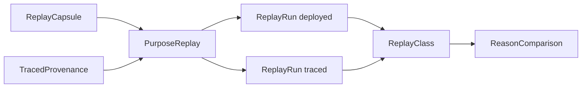

# Data model: traced refusal reasons

Owned by `modules-model.md` conformance-replay unless stated. Wire shapes of stored files are in
`contracts/replay-evidence.md`.

## replaycapsule ReplayCapsule

| Field | Meaning |
|---|---|
| `rejectedTxId` | id of the rejected transaction body |
| `transaction` | the rejected transaction's bytes, as submitted |
| `resolved` | every output the transaction spends or references (inputs, reference inputs, collateral), by output reference, as the node returned them |
| `protocolParameters` | node protocol parameters at capture, cost models included |
| `systemStart`, `eraHistory` | node values used to translate validity bounds |
| `node` | node identity already recorded by receipts |
| `failingHashes` | script hashes the node reported as failing |
| `captureId` | sha256 over the canonical capsule files |

Invariants: captured before the run's next submission; `resolved` covers every
reference in the transaction or the capsule is incomplete (class
`capture-incomplete`); never edited after `captureId` is computed.

## tracedprovenance-output-read-by TracedProvenance (build-traced-registry-blueprint-from-onchain-build output, read by conformance-run-replay)

| Field | Meaning |
|---|---|
| `source` | store path of the `onchain` source tree both builds read |
| `compiler` | compiler version string of the toolchain |
| `flags` | the trace flags, exactly `--trace-filter user-defined --trace-level verbose` |
| `untracedHashes` | every validator hash of the same toolchain built without traces |
| `validators` | titles and parameter schemas of the traced blueprint |

Invariant: the correspondence check (toolchain-correspondence) passed for this provenance; at run
time the deployed blueprint's hashes equal `untracedHashes`, else no replay is
admitted (`toolchain-mismatch`).

## purposereplay PurposeReplay

One failing purpose of one capsule: `deployedHash` (the failing hash),
`tracedHash` (hash of the traced code with the same parameters), the purpose
(spend, mint, …) and redeemer index, and two runs.

## replayrun ReplayRun

`bytesHash`, `budgetLimit`, `budgetUsed`, `outcome ∈ {succeeded, validator-failure(logs), budget-exhausted, evaluation-error(text)}`.
The deployed run's limit is the transaction's declared units for the purpose;
the traced run's is the protocol per-transaction maximum.

## replayclass ReplayClass

`admitted(reason)` or `unobserved(cause)`, cause one of:
`capture-incomplete`, `context-unavailable`, `toolchain-mismatch`,
`no-replay-route` (the failing script's family is identified — an untraced
application of a deployed-blueprint validator, built from the capture,
reproduces the failing hash — but the replay has no traced route for it),
`parameters-mismatch` (the failing script's family is identified by evidence
other than that hash — the run's recorded role for the script — an application
of it was attempted from the capture, and its untraced hash differs from the
failing hash), `unidentified-script` (no family is identified and no
application is claimed as attempted),
`deployed-succeeds`, `deployed-budget`, `traced-succeeds`, `traced-budget`,
`no-user-trace`, `several-user-traces`, `phase-1` (the node rejected before
scripts ran), `setup-failure` (the run could not reach the evaluation),
`timeout`, `client-exception`, `evaluation-error` (the evaluator itself
failed). Each is a distinct value; none is a coarse bucket for another.

Invariant: `admitted` ⇔ deployed `validator-failure` ∧ traced
`validator-failure` with exactly one user-defined log line ∧ no earlier cause;
`reason` is that line verbatim.

## reasoncomparison ReasonComparison

`agrees` (admitted ∧ reason = Lean's), `differs(chain, lean)`,
`uncompared(cause)`. Only a step where both sides refuse and the model names a
reason is compared; that fact, not a label, makes the refusal class A; attribution rows carry replayclass only. Durability: the index entry
(contract) records `modelReason` and the reasoncomparison value before the runner acts on it.
`differs` then fails the row, so its evidence survives in the replay index
though no receipt is written for a failed row. `uncompared` does not fail the
row: the step's existing outcome comparison stays `agrees`, the receipt is
written with no chain-side reason, and the index names the cause; it is never
counted as reason agreement.

## Receipt replay object (self-contained-replay-receipt, operator ruling 2026-10-01)

Additive and optional, on step `chain.refusal` and on `RefusalInfo`:
`replay = { deployedHash, tracedHash, reason | cause, captureId }`, one per
failing purpose (a list where several purposes fail). `reason` only for replayclass
`admitted`; `cause` the replayclass name otherwise; `tracedHash` absent only when no
traced application exists (`no-replay-route`, `unidentified-script`). Once per
receipt with any `replay`: `replayCorrespondence = { source, compiler, flags,
untracedHashesDigest }` from tracedprovenance-output-read-by. Existing fields (`trace`, `branch`, `limit`,
`hashes`) keep their meaning. Loader: absent object accepted (legacy); present
object must be complete and agree with `trace`/`branch`; size cap raised only
to the measured largest receipt with the object plus headroom (the current
largest, retire-active-key at 0287727, is 12 910 bytes before it).
