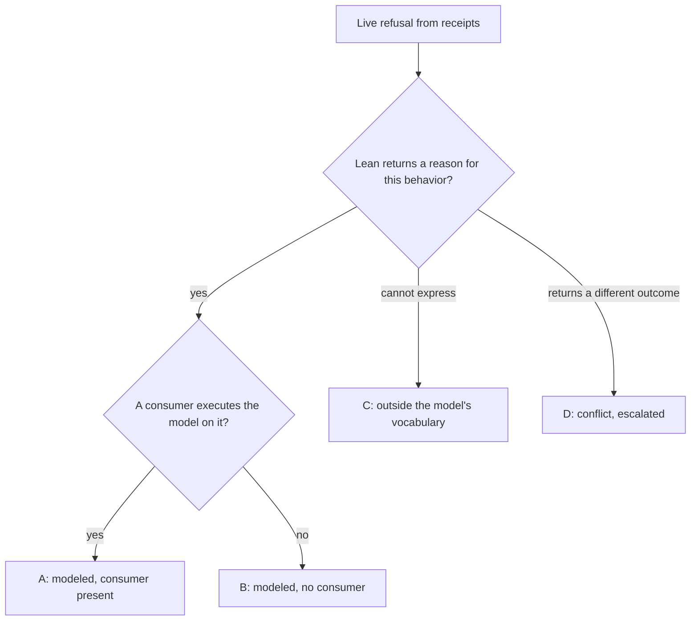

# Refusal extent against the model

Every live refusal the conformance runs produce belongs to the issue's
denominator. Each is classified against Lean's semantics and against the
executing consumer, separately. A runner that only attributes a refusal is not
a scope ruling. This table is a planning lead from source at base `3f04e50`
(Lean `lean/Singular/Model.lean` blob `9c75b37380d5`); T028 replaces it with the
extent discovered from executed receipts.

## Classes

Class A is not a label anyone assigns. A refusal is class A exactly when its
step record carries an executed model question with a refused outcome and a
reason; the runner writes that fact into the index, and every such refusal
must agree or be uncompared with a named cause. B, C and D apply only to
refusals without an executed model reason, and come from the committed table
below, keyed by row and refusal; a refusal with a model reason can never carry
them, and a refusal without one that the table does not list fails the extent
check as unclassified.

| Class | Meaning | What #287 claims |
|---|---|---|
| A | Lean returns a reason and the driver comparison executes it | traced reason compared with Lean's (FR-09) |
| B | Lean returns a reason; no consumer executes the model on this behavior | traced reason recorded; the model comparison is an unmet gap, published |
| C | Lean cannot express the behavior | traced reason recorded; gap published; escalated to the epic as a user story |
| D | Lean's outcome differs from the chain's or from the bound consumer model | traced reason recorded; escalated; no agreement claimed |

## Leads

| Row | Refusal | Lean | Consumer | Class (lead) |
|---|---|---|---|---|
| CG07 | retraction outside phase 2 | `not-phase2`, `retractAdmission` | driver | A |
| CG21 | duplicate insert; wrong destination; short deposit | `key-exists` (Model.lean:553), `destination`, `deposit-returned` | driver | A |
| CG22 | `updateTerminal` on unknown, on absent; two deposit tampers | `key-unknown`, `not-booked`, `deposit-returned` | driver | A |
| CG23 | reject and retract payment tampers; state spent; not retractable; owner unsigned | `deposit-returned`, `retract-state-spent`, `withdraw-insert-only`, `retract-owner` | driver | A |
| CG05 | insert on a present key | `key-exists` (Model.lean:553) | attribution only | B |
| CG21 | two-key batch whose claimed mint disagrees per key | `net-mint-mismatch` (Model.lean:667); the driver evaluates one request per transaction | none | B |
| CG10 | fold with claims against a superseded root | the model's root is an abstract commitment; a stale proof is not an input of `step` | attribution only | C |
| CS04 | redeemer at a wrong constructor index | serialization below the model's vocabulary | attribution only | C |
| CG09 | reject while the request is still in phase 1 | `exitStep .reject` has no admission and succeeds (Model.lean:1060-1072, 1198-1204) | attribution only | D (Q-003; D287-REJECT hold) |
| CG19 | crossed refund allocation | consumer-model conflict already recorded as unresolved in the row | attribution only | D (existing) |

## Discovered table (T028)

From executed receipts and replay indexes (coder-1 EXTENT-R2.md sha256
3029f2b6…, runs D-001..D-009 and the in-gate book runs, Lean blob
`9c75b37380d5`). Class A is not listed: it is every refusal whose step carries
an executed model reason, recorded by the runner (17 steps in CG07, CG21,
CG22, CG23; all admit Lean's reason). Every other discovered refusal:

| Row | Refusal | Traced reason | Lean | Class |
|---|---|---|---|---|
| CG05 | insert on a present key | `key-exists` | `key-exists` (Model.lean:553); no consumer runs the model | B |
| CG11 | empty fold | `empty-fold` | `foldBatch` refuses `empty-fold` (Model.lean:665); row held by the recorded consumer-model conflict (Q-002) | D (existing) |
| CG12 | surplus actions; missing-action control | `surplus-actions`, `missing-action` | actions are not a model input; row held (Q-002) | D (existing) |
| CG19 | crossed refund allocation; rejected-floor control | `deposit-returned` | consumer-model conflict recorded unresolved (Q-002) | D (existing) |
| CG10 | fold with claims against a superseded root | `key-exists` | a stale proof is not an input of `step` | C |
| CS04 | redeemer at a wrong constructor index | witness `no-fold` (offline replay); state and request `no-user-trace` | serialization below the model's vocabulary | C |
| CG09 | reject in phase 1 | `not-rejectable` (D-006) | `exitStep .reject` has no admission (Model.lean:1060-1072) | D — ruled 2026-10-01: Lean kept, validator to be repaired in a predecessor; unmet until it lands |

The lead "CG21 two-key batch `net-mint-mismatch`" was not found in any
executed receipt: no CI-run row submits it today, so it is neither compared
nor observed — a published gap, not a class.

Gaps B, C and D stay in the denominator and in the book's limits. A partial
reason comparison over class A is never called completion of the issue's
every-row claim.
