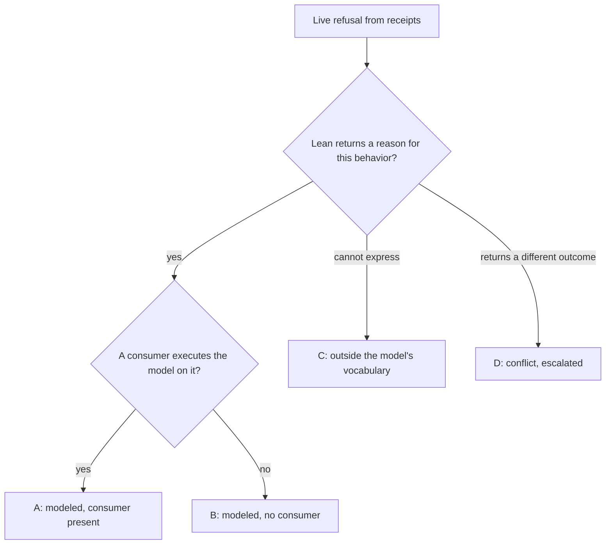

# Refusal extent against the model

Every live refusal the conformance runs produce belongs to the issue's
denominator. Each is classified against Lean's semantics and against the
executing consumer, separately. A runner that only attributes a refusal is not
a scope ruling. This table is a planning lead from source at base `3f04e50`
(Lean `lean/Singular/Model.lean` blob `9c75b37380d5`); T028 replaces it with the
extent discovered from executed receipts.

## Classes

| Class | Meaning | What #287 claims |
|---|---|---|
| A | Lean returns a reason and the driver comparison executes it | traced reason compared with Lean's (FR-09) |
| B | Lean returns a reason; no consumer executes the model on this behavior | traced reason recorded; the model comparison is an unmet gap, published |
| C | Lean cannot express the behavior | traced reason recorded; gap published; escalated to the epic as a user story |
| D | Lean's outcome differs from the chain's or from the bound consumer model | traced reason recorded; escalated; no agreement claimed |

## Leads

| Row | Refusal | Lean | Consumer | Class (lead) |
|---|---|---|---|---|
| CG07 | retraction outside phase 2 | `not-phase2`, `retractAdmission` | driver | A |
| CG21 | duplicate insert; wrong destination; short deposit | `key-exists` (Model.lean:553), `destination`, `deposit-returned` | driver | A |
| CG22 | `updateTerminal` on unknown, on absent; two deposit tampers | `key-unknown`, `not-booked`, `deposit-returned` | driver | A |
| CG23 | reject and retract payment tampers; state spent; not retractable; owner unsigned | `deposit-returned`, `retract-state-spent`, `withdraw-insert-only`, `retract-owner` | driver | A |
| CG05 | insert on a present key | `key-exists` (Model.lean:553) | attribution only | B |
| CG21 | two-key batch whose claimed mint disagrees per key | `net-mint-mismatch` (Model.lean:667); the driver evaluates one request per transaction | none | B |
| CG10 | fold with claims against a superseded root | the model's root is an abstract commitment; a stale proof is not an input of `step` | attribution only | C |
| CS04 | redeemer at a wrong constructor index | serialization below the model's vocabulary | attribution only | C |
| CG09 | reject while the request is still in phase 1 | `exitStep .reject` has no admission and succeeds (Model.lean:1060-1072, 1198-1204) | attribution only | D (Q-003; D287-REJECT hold) |
| CG19 | crossed refund allocation | consumer-model conflict already recorded as unresolved in the row | attribution only | D (existing) |

Gaps B, C and D stay in the denominator and in the book's limits. A partial
reason comparison over class A is never called completion of the issue's
every-row claim.
