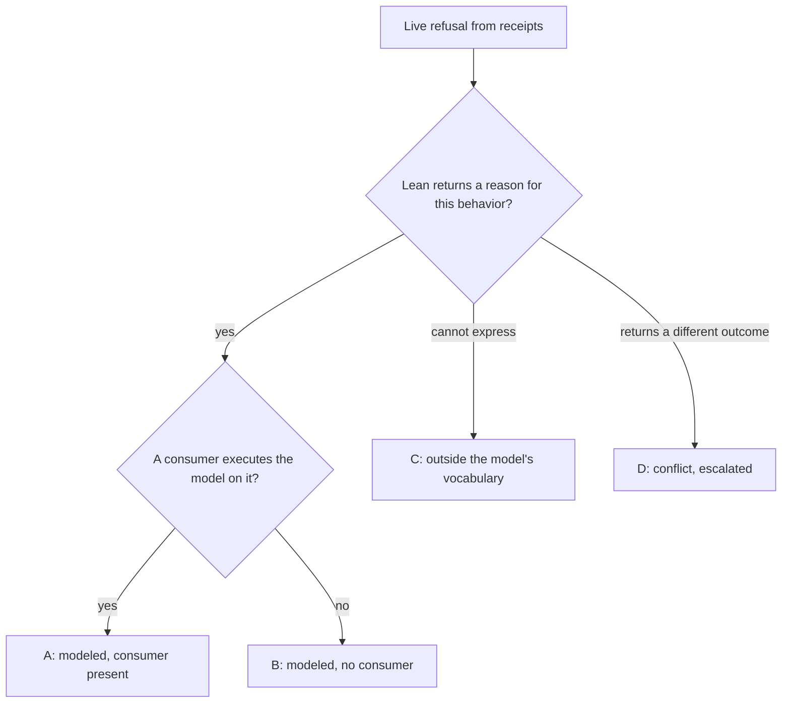

# Refusal extent against the model

Every live refusal the conformance runs produce belongs to the issue's
denominator. Each is classified against Lean's semantics and against the
executing consumer, separately. A runner that only attributes a refusal is not
a scope ruling. This table is a planning lead from source at base `3f04e50`
(Lean `lean/Singular/Model.lean` blob `9c75b37380d5`); from-receipts-replay-index-discover-complete replaces it with the
extent discovered from executed receipts.

## Classes

Class A is not a label anyone assigns. A refusal is class A exactly when its
step record carries an executed model question with a refused outcome and a
reason; the runner writes that fact into the index, and every such refusal
must agree or be uncompared with a named cause. B, C and D apply only to
refusals without an executed model reason, and come from the committed table
below, keyed by row and refusal; a refusal with a model reason can never carry
them, and a refusal without one that the table does not list fails the extent
check as unclassified.

| Class | Meaning | What #287 claims |
|---|---|---|
| A | Lean returns a reason and the driver comparison executes it | traced reason compared with Lean's (compare-observed-refusal-reasons) |
| B | Lean returns a reason; no consumer executes the model on this behavior | traced reason recorded; the model comparison is an unmet gap, published |
| C | Lean cannot express the behavior | traced reason recorded; gap published; escalated to the epic as a user story |
| D | Lean's outcome differs from the chain's or from the bound consumer model | traced reason recorded; escalated; no agreement claimed |

## Leads

| Row | Refusal | Lean | Consumer | Class (lead) |
|---|---|---|---|---|
| retract-outside-window | retraction outside phase 2 | `not-phase2`, `retractAdmission` | driver | A |
| register-active-key | duplicate insert; wrong destination; short deposit | `key-exists` (Model.lean:553), `destination`, `deposit-returned` | driver | A |
| retire-active-key | `updateTerminal` on unknown, on absent; two deposit tampers | `key-unknown`, `not-booked`, `deposit-returned` | driver | A |
| reject-and-retract-refund-controls | reject and retract payment tampers; state spent; not retractable; owner unsigned | `deposit-returned`, `retract-state-spent`, `withdraw-insert-only`, `retract-owner` | driver | A |
| insert-occupied-key | insert on a present key | `key-exists` (Model.lean:553) | attribution only | B |
| register-active-key | two-key batch whose claimed mint disagrees per key | `net-mint-mismatch` (Model.lean:667); the driver evaluates one request per transaction | none | B |
| fold-against-superseded-root | fold with claims against a superseded root | the model's root is an abstract commitment; a stale proof is not an input of `step` | attribution only | C |
| wrong-redeemer-constructor-index | redeemer at a wrong constructor index | serialization below the model's vocabulary | attribution only | C |
| reject-before-deadline-consumer-requirement | reject while the request is still in phase 1 | `exitStep .reject` has no admission and succeeds (Model.lean:1060-1072, 1198-1204) | attribution only | D (operator question (Q-003); comparison-unmet hold) |
| request-value-and-refund-routing | crossed refund allocation | consumer-model conflict already recorded as unresolved in the row | attribution only | D (existing) |

## Discovered table (from-receipts-replay-index-discover-complete)

Rebound 2026-10-02 to main `13f2b2e` (#320's validators, #344's batch
questions) under the operator's narrowed acceptance. Class A is not listed: it
is every refusal whose step or batch carries an executed model reason, recorded
by the runner — the story rows' refused steps (insert-occupied-key, retract-outside-window, register-active-key, retire-active-key, reject-and-retract-refund-controls,
reject-inside-processing-and-retraction-windows), the fold batches (empty-fold's empty fold, register-active-key's two-key batch whose mint is
moved onto its first key) and the reject batches (request-value-and-refund-routing's crossed refunds and its
rejected-floor control, reject-before-deadline-consumer-requirement's short reject control), each compared with the
reason the traced replay admits for the state script. reject-before-deadline-consumer-requirement's row transaction is
accepted by the chain and by the model, so it is no refusal; its consumer
requirement stays unmet by ruling (operator 2026-10-01).

Every other discovered refusal is listed below. fold-against-superseded-root, surplus-fold-actions and wrong-redeemer-constructor-index have no
counterpart in the model: their receipts carry the verdict `unmet-by-ruling`
(operator ruling 2026-10-02), and their model comparison is published as unmet,
beside the traced chain evidence or its absence, tracked by the issue that would
give the model the vocabulary. reject-before-deadline-consumer-requirement's divergence control is the one refusal Lean
answers otherwise (class D):

| Row | Refusal | Traced reason | Lean | Class |
|---|---|---|---|---|
| fold-against-superseded-root | fold whose proof was built against a superseded root | `key-exists` | the model takes no proof and no authenticated root, and admits the insertion on that unoccupied key | C — model comparison unmet, lambdasistemi/singular#346 |
| surplus-fold-actions | surplus action; missing-action control | `surplus-actions`, `missing-action` | the model takes no action list | C — model comparison unmet, lambdasistemi/singular#345 |
| reject-before-deadline-consumer-requirement | known divergence control: a reject paying its owner one lovelace short at the refund's position and the remainder in another output at the owner's key | `deposit-returned` | `settle` sums the owner's outputs and `rejectBatch` accepts | D — recorded divergence, never a pass, lambdasistemi/singular#361 |
| wrong-redeemer-constructor-index | fold redeemer at a wrong constructor index | witness `no-fold`; state and request `no-user-trace`, a failure with no user-defined trace | the model has no redeemer decoding vocabulary | C — model comparison unmet, lambdasistemi/singular#347 |

The earlier leads "register-active-key two-key batch `net-mint-mismatch`" and "empty-fold, request-value-and-refund-routing held
by operator question (Q-002) with no batch question" are now compared (class A); whether empty-fold, surplus-fold-actions
and request-value-and-refund-routing meet the consuming project's requirements stays held, a consumer
question separate from the model comparison; surplus-fold-actions is unmet by ruling.

Gaps C stay in the denominator and in the book's limits. A reason comparison
over class A is never called completion of the issue's every-row claim while a
C row remains.

## A conflict the compared rejects avoid

The reject comparisons (reject-before-deadline-consumer-requirement's control, request-value-and-refund-routing's crossed refunds and its
rejected-floor control, and the story chapters' one-lovelace-short rejects)
agree only for the shape their fixtures give the transaction: every output at a
request owner's key is that owner's refund. The chain and the model read an
owner's payment differently, and a transaction of another shape separates them.
Operator ruling 2026-10-02, "Record now, fix later": reject-before-deadline-consumer-requirement submits that shape on
the devnet and records the disagreement in its receipt (the class D row above),
never as a pass; reject-refund equivalence in general stays unmet,
lambdasistemi/singular#361.

| Case | Chain | Lean | Class |
|---|---|---|---|
| a reject paying its owner short in the refund's position and the remainder in another output at the owner's key | refused `deposit-returned`: `refundFault` (onchain/validators/registry/settlement.ak) requires the output in each consumed row's position to pay that row's owner at least what is owed | accepted: `settle` (lean/Singular/Model.lean) credits an owner the sum of every output at its key, and `rejectBatch` settles through it | D — run in reject-before-deadline-consumer-requirement, recorded, lambdasistemi/singular#361 |

Main's reject-before-deadline-consumer-requirement control before this delivery had that shape: its request was owned
by the genesis wallet, refunding one lovelace short, while the fold returned its
change to the same wallet. The chain refused it; the model, asked on those
outputs, would have accepted. The compared rows now book their owners from
wallets that receive no change, and the story tampers move every other output
at the owner's key elsewhere.
