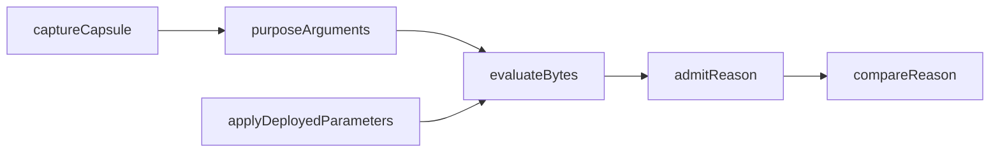

# Functions model: traced refusal reasons

New or changed callables only, grouped by component (`modules-model.md`).
Types name data rows (`data-model.md`); ledger and node types are the ones the
lock already provides. No bodies.

## conformance-replay `Conformance.Replay`

| Function | Arguments | Result | Constraint |
|---|---|---|---|
| `admitReason` | `deployedRun :: ReplayRun`, `tracedRun :: ReplayRun`, `precondition :: Maybe UnobservedCause` | `ReplayClass` | pure; the precondition carries an earlier cause (capture, toolchain, parameters) and wins; implements replayclass's invariant |
| `compareReason` | `leanReason :: Text`, `chainReplay :: ReplayClass` | `ReasonComparison` | pure; reasoncomparison |
| `captureIdOf` | `capsuleFiles :: [(FilePath, ByteString)]` | `Text` | pure; order-independent over canonical names |
| `userTraces` | `logs :: [Text]` | `[Text]` | pure; the user-defined lines of an evaluation log under the traced flags |

## conformance-run-replay `Conformance.Run.Replay`

| Function | Arguments | Result | Constraint |
|---|---|---|---|
| `captureCapsule` | `provider`, `rejected :: ConwayTx`, `failing :: [ScriptHash]`, `nodeId :: Text` | `IO (Either UnobservedCause ReplayCapsule)` | queries the node before any later submission; no transaction is built or signed |
| `purposeArguments` | `capsule :: ReplayCapsule`, `failing :: ScriptHash` | `Either UnobservedCause [PurposeContext]` | the ledger's own construction of datum, redeemer and context for each purpose run by `failing`; `context-unavailable` otherwise |
| `applyDeployedParameters` | `provenance :: TracedProvenance`, `deployedConfig`, `failing :: ScriptHash` | `Either UnobservedCause (PlutusBytes, ScriptHash)` | the deployed parameter values applied to traced code; `parameters-mismatch` unless the same values on the untraced code hash to `failing` |
| `evaluateBytes` | `context :: PurposeContext`, `bytes :: PlutusBytes`, `budget :: ExUnits` | `ReplayRun` | evaluation with logs on unchanged arguments; the purpose keeps `failing` as its identity |
| `replayRefusal` | `provider`, `provenance`, `deployedConfig`, `rejected :: ConwayTx`, `failing :: [ScriptHash]`, `evidenceDir :: FilePath` | `IO [PurposeReplay]` | composes the above, writes capsule files under `evidenceDir`, never throws past a class |

`PurposeContext` is the ledger's script-with-arguments value for one purpose;
`deployedConfig` is the run's existing deployed configuration.

## changed-signatures–wrong-reason-control-one-row-one-step changed signatures

| Function | Change |
|---|---|
| `Conformance.Run.Step.StepRefused` | its reason field holds `[PurposeReplay]` (via `ReplayClass`) instead of the node-text substring tag; `storyRefusalTag` is removed with its last caller |
| `Conformance.Run.Live` comparison of a refused step | takes `ReasonComparison` into the step's `comparison`: `agrees` only on reasoncomparison `agrees` |
| `Conformance.Refusal.attributeRefusalReceipt` | gains `replay :: [PurposeReplay]`; `branch`/`limit` from it (classify-refusal-comparison-extent) |
| `Conformance.Book` limits paragraph | text restated (book-states-observation-limits); its condition is enforced by complete-refusal-extent at the head, since deriving the book from receipts is #225 |
| `Conformance.Run.Control` | gains the wrong-reason control: `row`, `step index`, `replacementReason :: Text` |
