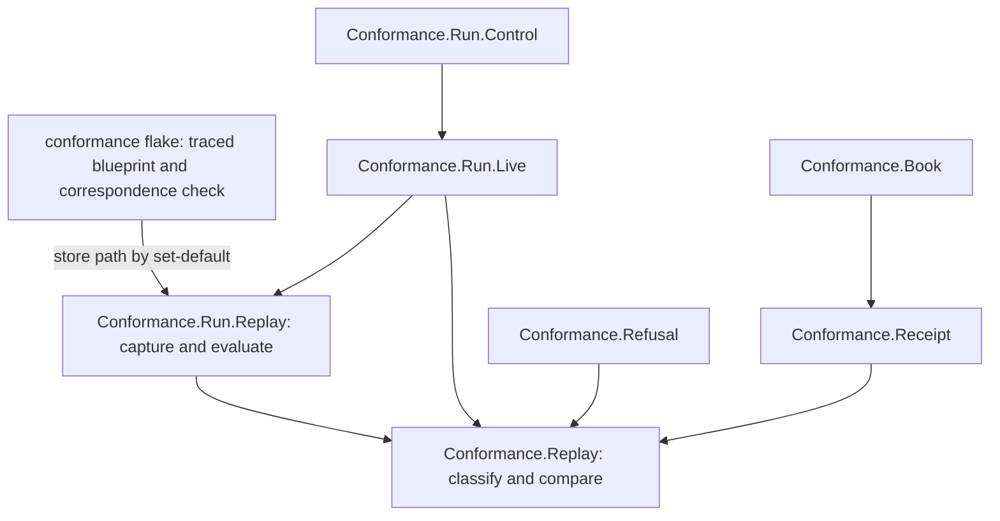

# Modules model: traced refusal reasons

New or changed components only. Fields live in `data-model.md`, signatures in
`functions-model.md`.

| ID | Component | Responsibility | Depends on | Change |
|---|---|---|---|---|
| build-traced-registry-blueprint-from-onchain-build | `conformance/flake.nix` | Build the traced registry blueprint from `../onchain` (traced-validator-build); build a check that the same toolchain untraced reproduces `onchain/script-identity.json` and that traced/untraced name the same validators and parameter schemas (toolchain-correspondence); carry the traced blueprint and its provenance to the conformance app (`REGISTRY_TRACED_BLUEPRINT`, set-default) | `../onchain` source, existing lock | new outputs, wrapper line |
| conformance-replay | `Conformance.Replay` (lib, pure) | Capsule and provenance types, the admission of a traced reason from two evaluation results (deployed-refusal-reproduction–separate-evidence-classes), the reason comparison (compare-observed-refusal-reasons), capture identity | aeson, text, bytestring only | new |
| conformance-run-replay | `Conformance.Run.Replay` (app, effects) | Capture a capsule at rejection from the node (capture-refused-transaction); obtain the ledger's script arguments for each failing purpose from the capsule; evaluate given bytes on them under a given budget, with logs (matching-script-parameters–deployed-refusal-reproduction); apply the deployed parameters to traced code and check the untraced application hash (matching-script-parameters); write capsule files beside the receipts | conformance-replay, offchain library, cardano-node-clients and ledger already in the lock | new |
| changed-signatures | `Conformance.Run.Live`, `Conformance.Run.Step` | Call conformance-run-replay at each validator rejection before the next submission; replace the node-text substring "trace" with conformance-replay's result; compare reasons for refused-refused steps | conformance-replay, conformance-run-replay | changed |
| conformance-refusal-attribution-callers | `Conformance.Refusal`, attribution callers | Put an admitted reason in `branch`; keep the existing limit when unobserved; carry the refusal's extent class (classify-refusal-comparison-extent) | conformance-replay | changed |
| serialize-load-replay-fields-decided-by-q | `Conformance.Receipt` | Serialize and load the replay fields decided by operator question (Q-001); the loader rejects a refused step whose replay evidence is claimed but incomplete | conformance-replay | changed |
| restate-limit-text-enforces-its-condition-until | `Conformance.Book` | Restate the limit text (book-states-observation-limits); complete-refusal-extent enforces its condition until #225 derives the book | serialize-load-replay-fields-decided-by-q | changed |
| wrong-reason-control-one-row-one-step | `Conformance.Run.Control` | The wrong-reason control: one row, one step, the model reason replaced before comparison (wrong-reason-control) | changed-signatures | changed |
| github-workflows-conformance-yml | `.github/workflows/conformance.yml` | Carry retirement-refund-window-reasons–complete-refusal-extent | build-traced-registry-blueprint-from-onchain-build–wrong-reason-control-one-row-one-step | changed |

## Placement decisions

- Admission and comparison are pure (conformance-replay) so every class in separate-evidence-classes is a
  table-driven unit case without a devnet; effects stay in conformance-run-replay.
- Nothing is promoted into `offchain/`: the replay is a harness concern with
  one consumer. If conformance-run-replay cannot reach the ledger's script arguments without an
  `offchain/` change, that is a placement challenge to the ticket owner.
- The traced build lives with the harness (build-traced-registry-blueprint-from-onchain-build), beside the naming blueprint
  precedent; `onchain/flake.nix` stays the only deployed recipe.
- The control (wrong-reason-control-one-row-one-step) alters only the model side of one comparison; it never
  edits a capsule, a trace or a receipt after the fact.
