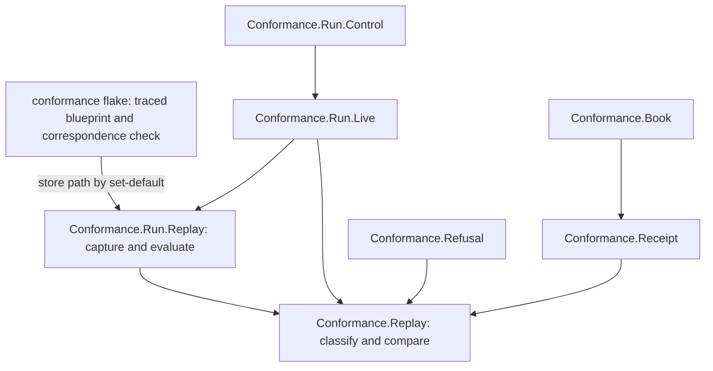

# Modules model: traced refusal reasons

New or changed components only. Fields live in `data-model.md`, signatures in
`functions-model.md`.

| ID | Component | Responsibility | Depends on | Change |
|---|---|---|---|---|
| M1 | `conformance/flake.nix` | Build the traced registry blueprint from `../onchain` (FR-02); build a check that the same toolchain untraced reproduces `onchain/script-identity.json` and that traced/untraced name the same validators and parameter schemas (FR-03); carry the traced blueprint and its provenance to the conformance app (`REGISTRY_TRACED_BLUEPRINT`, set-default) | `../onchain` source, existing lock | new outputs, wrapper line |
| M2 | `Conformance.Replay` (lib, pure) | Capsule and provenance types, the admission of a traced reason from two evaluation results (FR-06–FR-08), the reason comparison (FR-09), capture identity | aeson, text, bytestring only | new |
| M3 | `Conformance.Run.Replay` (app, effects) | Capture a capsule at rejection from the node (FR-01); obtain the ledger's script arguments for each failing purpose from the capsule; evaluate given bytes on them under a given budget, with logs (FR-04–FR-06); apply the deployed parameters to traced code and check the untraced application hash (FR-04); write capsule files beside the receipts | M2, offchain library, cardano-node-clients and ledger already in the lock | new |
| M4 | `Conformance.Run.Live`, `Conformance.Run.Step` | Call M3 at each validator rejection before the next submission; replace the node-text substring "trace" with M2's result; compare reasons for refused-refused steps | M2, M3 | changed |
| M5 | `Conformance.Refusal`, attribution callers | Put an admitted reason in `branch`; keep the existing limit when unobserved (FR-10) | M2 | changed |
| M6 | `Conformance.Receipt` | Serialize and load the replay fields decided by Q-001; the loader rejects a refused step whose replay evidence is claimed but incomplete | M2 | changed |
| M7 | `Conformance.Book` | Restate the limit text (FR-15); G10 enforces its condition until #225 derives the book | M6 | changed |
| M8 | `Conformance.Run.Control` | The wrong-reason control: one row, one step, the model reason replaced before comparison (FR-12) | M4 | changed |
| M9 | `.github/workflows/conformance.yml` | Carry G6–G10 | M1–M8 | changed |

## Placement decisions

- Admission and comparison are pure (M2) so every class in FR-08 is a
  table-driven unit case without a devnet; effects stay in M3.
- Nothing is promoted into `offchain/`: the replay is a harness concern with
  one consumer. If M3 cannot reach the ledger's script arguments without an
  `offchain/` change, that is a placement challenge to the ticket owner.
- The traced build lives with the harness (M1), beside the naming blueprint
  precedent; `onchain/flake.nix` stays the only deployed recipe.
- The control (M8) alters only the model side of one comparison; it never
  edits a capsule, a trace or a receipt after the fact.
