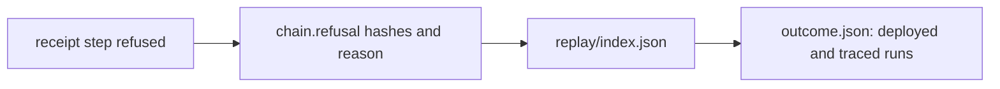

# Quickstart: check a refusal reason yourself

For a reader holding a CI run's `conformance-receipts` artifact.

1. Build the traced blueprint the run used:
   `nix build ./conformance#registry-traced-blueprint` (name fixed by R1).
2. In a receipt, pick a step whose `chain.outcome` is `refused`; read its
   model reason and chain-side reason.
3. Find its rejected transaction id in `replay/index.json`; open
   `replay/<txid>/outcome.json`: the deployed run failed as a validator, the
   traced run failed with one user trace equal to the chain-side reason, and
   `deployedHash` equals the hash the node reported.
4. Recompute `captureId` over the capsule files and compare.

The deployed validators carry no traces: the reason comes from re-running the
refused transaction's own arguments with the traced build of the same source.
