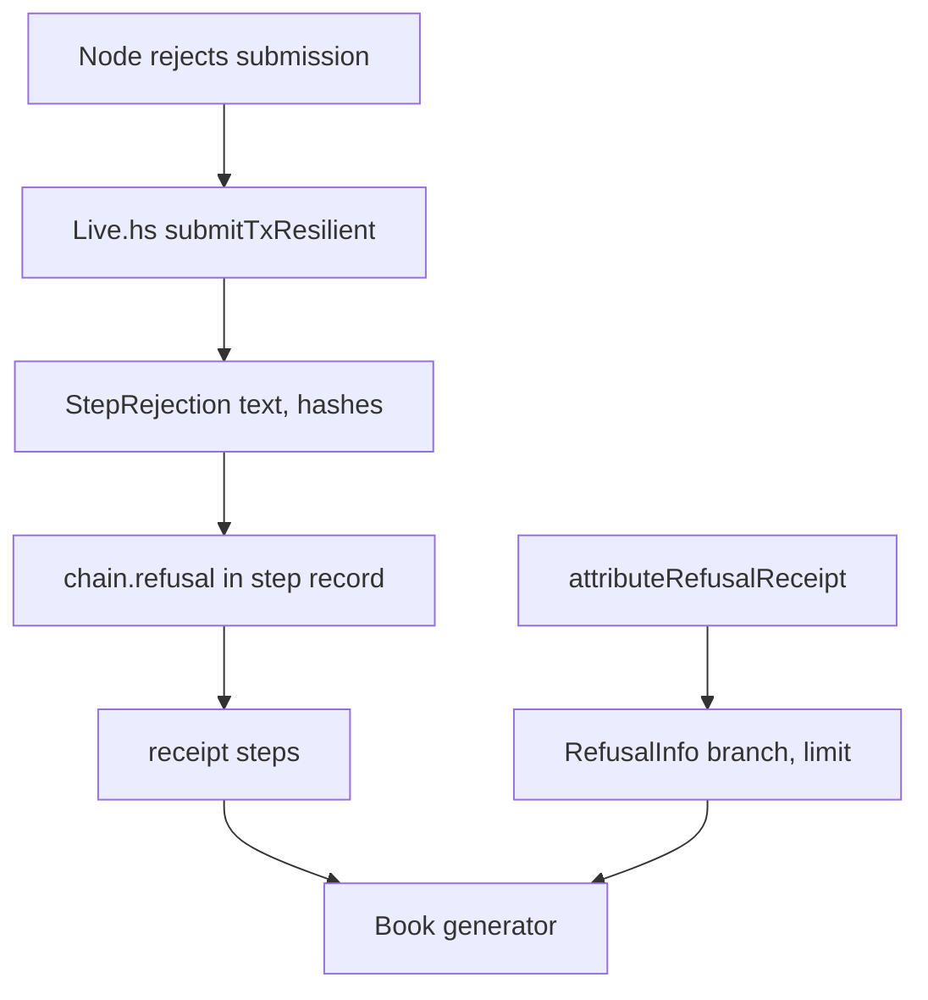

# Research: traced refusal reasons

Facts at base `3f04e50`, read from source; "lead" marks an unexecuted reading.
Source reading is planning evidence only, never refusal evidence.

## Where live refusals arise

- Driver-compared steps: `conformance/app/Conformance/Run/Live.hs:768`
  submits; node text lands in `Rejected` at `:823`; the refusing script is
  chosen by exit (`:826-830`); `StepRejection` is built at `:831-842`.
- The step record's `chain.refusal` is `rejectionJson` (`Live.hs:2725-2740`):
  `trace`, `hashes`, `kind` (validator or budget), `rejection`, budget fields,
  plus `scripts`. When both sides refuse, `comparison` is `agrees` with no
  reason comparison (`Live.hs:2519-2525`).
- Today's `trace` is `storyRefusalTag` (`Step.hs:77-84`), a substring search of
  node text for three names; with untraced scripts it is empty.
- Attribution rows write `RefusalInfo` (`conformance/lib/Conformance/Receipt.hs:109-138`)
  through `attributeRefusalReceipt` (`conformance/lib/Conformance/Refusal.hs`)
  with `branch = Nothing` and a fixed limit; callers `Run/Submit.hs:65,133`,
  `Run/CgRows.hs:1424`.
- Receipt bounds: `maxReceiptBytes = 16384`, `maxLiveStepReasonChars = 300`;
  CI holds CG23 and CG07 receipts at 14745 bytes.

## Refused steps CI produces today

From `.github/workflows/conformance.yml` assertions: CG22 four
(`not-booked`, `key-unknown`, two `deposit-returned`); CG23 eight (reject and
retract tampers: `deposit-returned`, `retract-state-spent`,
`withdraw-insert-only`, `retract-owner`); CG07 two (`not-phase2`); CG21 three
(`key-exists`, `destination`, `deposit-returned`). Attribution refusals run in
the generic (CG05, CG09, CG10, CG19) and serialization (CS04) sessions. This
list is a lead: the ticket's denominator is counted from receipts (FR-14).

## Reason vocabulary on chain

The validators construct the Lean refusal names verbatim (`onchain/validators/request.ak:119-151`,
`registry/trie.ak`, `registry/discharge.ak`, `registry/refusal.ak:40-54`,
`lib.ak`) and report a named refusal by one user-defined trace then `False`
(`registry/refusal.ak:36-44`, `request.ak:36`). Genesis, `End`, `Migrating`,
`Burning`, unmatched arms and malformed continuations fail without a reason
(`state.ak:86-92`): such refusals can only be "unobserved".

## Builds

- Deployed: `onchain/flake.nix` `plutus-blueprint` runs bare `aiken build`;
  hashes pinned in `onchain/script-identity.json` (compiler `v1.1.21+unknown`).
  Lead: Aiken's `build` defaults to silent traces, matching the issue's evidence
  (run 36043950326: ten of ten refusals, `CekError`, no logs). The comment at
  `onchain/validators/registry/refusal.ak:26-28` says the published blueprint
  keeps user traces; T026 settles this by evaluating the deployed bytes with
  logs on a captured refusal (Q-002). A byte search is not discriminating:
  the deployed compiled code contains `deposit-returned`, `not-phase2`,
  `key-exists` and `retract-owner` because the reasons are data values the
  validators compute, whatever the trace level (planning observation,
  runtime `receipts/premise-001/findings.txt`).
- Precedent: `conformance/flake.nix:93-137` already builds the naming blueprint
  with `--trace-filter user-defined --trace-level verbose` from `../naming-onchain`.
  The registry source also needs `merkle-patricia-forestry` staged
  (`onchain/flake.nix:74-100`).
- `onchain/flake.lock`, `conformance/flake.lock` and `offchain/flake.lock`
  pin identical nixpkgs revisions, so the conformance flake's `pkgs.aiken` is
  expected to be the deployed compiler. FR-03 turns that expectation into a check.
- The runner gets the deployed blueprint through `REGISTRY_BLUEPRINT`; the
  conformance app wrapper sets `NAMING_BLUEPRINT` by `--set-default`
  (`conformance/flake.nix:289,307`), a carrier pattern for a traced blueprint.
- Parameters are applied by `offchain/lib/Singular/Registry/Blueprint/Params.hs`.

## Evaluation seam

- `measurePurposeUnits` (`Run/Units.hs:58-70`) calls `Cage.evaluateTx` and keeps
  a failure only as text; the provider returns per-purpose
  `Either TransactionScriptFailure ExUnits`
  (`offchain/node-internal/Singular/Registry/Provider.hs:44-49,63-65`).
- Lead (unverified at pin `0e73121d` of cardano-node-clients): evaluation is the
  ledger's `evalTxExUnits` over the node's UTxO, system start and era history,
  and a validation failure carries the ledger's script-with-context value — the
  exact script and arguments for the purpose. T001 verifies this at the pin.

## Alternatives rejected

- Resubmitting a transaction witnessed by traced scripts: the traced hash
  differs, so addresses, policy ids and redeemer pointers change and the
  context is no longer the refused one.
- Ledger re-evaluation with the traced script placed in the UTxO: ledger lookup
  is by hash and would still run the deployed bytes or fail to find the script.
- Reading reasons from the model or from the Aiken test suite: not chain
  evidence (FR-08).
- `--trace-filter all`: adds compiler `expect` traces, so "exactly one
  user-defined trace" would no longer identify the refusal.

## Book and published limit

- Limit text: `conformance/lib/Conformance/Book.hs:51`; committed render
  `conformance/BOOK.md:343`; asserted by `conformance/test/Conformance/Story/Usage.hs:83`.
- Also stated in `docs/theorems.md:133-136` and constitution rows `retract`,
  `settle` (`.specify/memory/constitution.md:421,429`): outside the fence (Q-002).
